# 設計書

## 概要

VirtuTuneはDjangoベースのWebアプリケーションで、仮想ギター演奏機能と進捗管理機能を提供します。MVCアーキテクチャを採用し、Djangoアプリを機能単位に分割したモジュール構成とします。

## アーキテクチャ

### ハイレベルアーキテクチャ


### システムコンポーネント

1. **Django Webアプリ**: メインのWebフレームワーク
2. **仮想ギターアプリ (guitar)**: 仮想ギター演奏機能を担当
3. **進捗管理アプリ (progress)**: 練習記録と進捗表示を担当
4. **ユーザーアプリ (users)**: 認証とプロフィール管理を担当
5. **コアアプリ (core)**: 共通機能とベーステンプレート
6. **Celery**: 非同期タスク（リマインダー送信）
7. **データベース**: SQLite（開発）/ PostgreSQL（本番）

### データフロー


---

## コンポーネントとインターフェース

### コアインターフェース

```python
# ユーザーインターフェース
from typing import Optional
from datetime import datetime, time

class User:
    id: int
    username: str
    email: str
    daily_goal_minutes: int
    reminder_enabled: bool
    reminder_time: Optional[time]
    streak_days: int
    total_practice_minutes: int
    created_at: datetime
    updated_at: datetime

# 練習セッションインターフェース
class PracticeSession:
    id: int
    user_id: int
    started_at: datetime
    ended_at: Optional[datetime]
    duration_minutes: int
    chords_practiced: list[str]  # JSONフィールド
    created_at: datetime

# コードインターフェース
class Chord:
    id: int
    name: str
    finger_positions: dict  # {"E2": 0, "A2": 1, "D2": 0, "G1": 2, "B1": 0, "e1": 0}
    difficulty: int
    diagram: str  # SVG形式
```

---

### コンポーネント: 仮想ギター (guitar)

**ステータス:** 🔴 未実装

**責務:**
- 仮想ギター画面の描画
- コードデータの提供
- 弦の操作に応じた音声再生
- コード切り替え処理

**主要メソッド:**
```python
class GuitarView:
    def get_guitar_page(request) -> HttpResponse
    def get_chord_data(chord_name: str) -> dict
    def play_string_sound(string_number: int, chord: Chord) -> None
    def change_chord(request) -> JsonResponse
```

**依存関係:**
- Django ORM
- Chordモデル
- 静的ファイル（音声、SVG）

**実装メモ:**
- 音声はHTML5 Audio APIで再生
- 弦の振動アニメーションはCSS Animationで実装
- コードダイアグラムは動的にSVG生成

---

### コンポーネント: 進捗管理 (progress)

**ステータス:** 🔴 未実装

**責務:**
- 練習セッションの作成・更新
- 進捗データの集計
- グラフデータの生成
- ストリーク計算

**主要メソッド:**
```python
class ProgressService:
    def start_session(user: User) -> PracticeSession
    def end_session(session: PracticeSession, chords: list[str]) -> None
    def get_daily_stats(user: User, days: int) -> list[dict]
    def get_total_stats(user: User) -> dict
    def calculate_streak(user: User) -> int
    def check_goal_achievement(user: User) -> bool
```

**依存関係:**
- PracticeSessionモデル
- Userモデル

**実装メモ:**
- ストリークは日次バッチで更新
- グラフデータはJSONで返却

---

### コンポーネント: ユーザー管理 (users)

**ステータス:** 🔴 未実装

**責務:**
- ユーザー認証
- プロフィール管理
- 目標設定
- リマインダー設定

**主要メソッド:**
```python
class UserService:
    def create_user(email: str, password: str, username: str) -> User
    def update_profile(user: User, **kwargs) -> None
    def update_daily_goal(user: User, minutes: int) -> None
    def update_reminder_settings(user: User, enabled: bool, time: time) -> None
    def delete_user(user: User) -> None
```

**依存関係:**
- Django Authentication System
- Userモデル

---

### コンポーネント: リマインダー (reminders)

**ステータス:** 🔴 未実装

**責務:**
- 定時メール送信
- 未練習ユーザーの検出
- 警告メール送信

**主要メソッド:**
```python
class ReminderService:
    def send_daily_reminders() -> None
    def send_streak_warning(user: User, missed_days: int) -> None
    def get_users_for_reminder() -> QuerySet[User]
```

**依存関係:**
- Celery
- Django Email Backend
- Userモデル

---

### コンポーネント: コア (core)

**ステータス:** 🔴 未実装

**責務:**
- ベーステンプレートの提供
- 共通コンテキストプロセッサ
- 静的ファイル管理
- 共通ユーティリティ

**主要メソッド:**
```python
class CoreUtils:
    def get_base_context(request) -> dict
    def format_duration(minutes: int) -> str
    def calculate_level(total_minutes: int) -> int
```

---

## データモデル

### ER図

```mermaid
erDiagram
    users ||--o{ practice_sessions : "練習記録"
    users ||--o{ user_chords : "習得コード"
    chords ||--o{ user_chords : "習得状況"
    chords ||--o{ practice_sessions : "使用コード(JSON)"

    users {
        BIGINT id PK
        VARCHAR(150) username UK
        VARCHAR(254) email UK
        VARCHAR(128) password
        INT daily_goal_minutes "5分"
        BOOLEAN reminder_enabled
        TIME reminder_time
        INT streak_days
        INT total_practice_minutes
        DATE last_practice_date
        TIMESTAMP created_at
        TIMESTAMP updated_at
    }

    practice_sessions {
        BIGINT id PK
        BIGINT user_id FK
        TIMESTAMP started_at
        TIMESTAMP ended_at
        INT duration_minutes
        JSON chords_practiced
        BOOLEAN goal_achieved
        TIMESTAMP created_at
    }

    chords {
        SMALLINT id PK
        VARCHAR(10) name UK
        JSON finger_positions
        TINYINT difficulty
        TEXT diagram
        SMALLINT display_order
    }

    user_chords {
        BIGINT user_id FK
        SMALLINT chord_id FK
        INT practice_count
        TIMESTAMP last_practiced_at
        TINYINT proficiency_level
        TIMESTAMP created_at
        TIMESTAMP updated_at
    }
```



---

### データベーススキーマ

#### テーブル1: users (ユーザーテーブル)

Djangoの認証システムを拡張したユーザーテーブル。

| カラム名 | タイプ | NULL | デフォルト | 説明 |
|---------|-------|------|-----------|------|
| id | BIGINT | NO | AUTO | 主キー |
| username | VARCHAR(150) | NO | - | ユーザー名（UNIQUE） |
| email | VARCHAR(254) | NO | - | メールアドレス（UNIQUE） |
| password | VARCHAR(128) | NO | - | パスワードハッシュ |
| daily_goal_minutes | INTEGER | NO | 5 | 1日の目標練習時間（分） |
| reminder_enabled | BOOLEAN | NO | FALSE | リマインダーON/OFF |
| reminder_time | TIME | YES | NULL | リマインダー送信時刻 |
| streak_days | INTEGER | NO | 0 | 連続練習日数 |
| total_practice_minutes | INTEGER | NO | 0 | 総練習時間（分） |
| last_practice_date | DATE | YES | NULL | 最終練習日 |
| is_active | BOOLEAN | NO | TRUE | アカウント有効フラグ |
| is_staff | BOOLEAN | NO | FALSE | 管理者フラグ |
| is_superuser | BOOLEAN | NO | FALSE | スーパーユーザーフラグ |
| last_login | TIMESTAMP | YES | NULL | 最終ログイン日時 |
| date_joined | TIMESTAMP | NO | NOW | 登録日時 |
| created_at | TIMESTAMP | NO | NOW | 作成日時 |
| updated_at | TIMESTAMP | NO | NOW | 更新日時 |

**制約:**
- UNIQUE: `username`, `email`
- CHECK: `daily_goal_minutes` BETWEEN 1 AND 1440

**インデックス:**
- `idx_username` ON (username)
- `idx_email` ON (email)
- `idx_streak` ON (streak_days DESC)
- `idx_last_practice` ON (last_practice_date)

---

#### テーブル2: practice_sessions (練習セッション)

ユーザーの各練習セッションを記録します。

| カラム名 | タイプ | NULL | デフォルト | 説明 |
|---------|-------|------|-----------|------|
| id | BIGINT | NO | AUTO | 主キー |
| user_id | BIGINT | NO | - | 外部キー（users） |
| started_at | TIMESTAMP | NO | - | 練習開始時刻 |
| ended_at | TIMESTAMP | YES | NULL | 練習終了時刻 |
| duration_minutes | INTEGER | NO | 0 | 練習時間（分） |
| chords_practiced | JSON | NO | '[]' | 使用したコードリスト |
| goal_achieved | BOOLEAN | YES | NULL | 目標達成フラグ |
| created_at | TIMESTAMP | NO | NOW | 作成日時 |

**制約:**
- FOREIGN KEY: `user_id` → users(id) ON DELETE CASCADE
- CHECK: `duration_minutes` >= 0
- CHECK: `ended_at` >= `started_at`

**インデックス:**
- `idx_practice_user_started` ON (user_id, started_at DESC)
- `idx_practice_user_date` ON (user_id, DATE(started_at) DESC)

---

#### テーブル3: chords (コードマスタ)

ギターコードのマスタデータ。

| カラム名 | タイプ | NULL | デフォルト | 説明 |
|---------|-------|------|-----------|------|
| id | SMALLINT | NO | AUTO | 主キー |
| name | VARCHAR(10) | NO | - | コード名（UNIQUE） |
| finger_positions | JSON | NO | - | 押弦位置データ |
| difficulty | TINYINT | NO | 1 | 難易度（1-5） |
| diagram | TEXT | YES | NULL | コードダイアグラム（SVG） |
| display_order | SMALLINT | NO | 0 | 表示順序 |
| created_at | TIMESTAMP | NO | NOW | 作成日時 |

**制約:**
- UNIQUE: `name`
- CHECK: `difficulty` BETWEEN 1 AND 5

**インデックス:**
- `idx_chords_name` ON (name)
- `idx_chords_difficulty` ON (difficulty)
- `idx_chords_display` ON (display_order)

**finger_positions JSON例:**
```json
{
  "E2": 0,  "A2": 0,
  "D2": 2,  "G1": 2,
  "B1": 1,  "e1": 0
}
```

---

#### テーブル4: user_chords (ユーザー習得コード)

ユーザーがどのコードを習得しているかを追跡します（将来拡張用）。

| カラム名 | タイプ | NULL | デフォルト | 説明 |
|---------|-------|------|-----------|------|
| user_id | BIGINT | NO | - | 外部キー（users） |
| chord_id | SMALLINT | NO | - | 外部キー（chords） |
| practice_count | INTEGER | NO | 0 | 練習回数 |
| last_practiced_at | TIMESTAMP | YES | NULL | 最終練習日時 |
| proficiency_level | TINYINT | NO | 0 | 習熟度（0-5） |
| created_at | TIMESTAMP | NO | NOW | 作成日時 |
| updated_at | TIMESTAMP | NO | NOW | 更新日時 |

**制約:**
- PRIMARY KEY: (user_id, chord_id)
- FOREIGN KEY: `user_id` → users(id) ON DELETE CASCADE
- FOREIGN KEY: `chord_id` → chords(id) ON DELETE CASCADE
- CHECK: `proficiency_level` BETWEEN 0 AND 5

**インデックス:**
- `idx_user_chords_user` ON (user_id)
- `idx_user_chords_proficiency` ON (proficiency_level)

---

### CREATE TABLE文（PostgreSQL版）

```sql
-- =====================================================
-- VirtuTune Database Schema
-- PostgreSQL 15+
-- =====================================================

-- 拡張機能の有効化
CREATE EXTENSION IF NOT EXISTS "uuid-ossp";

-- ユーザーテーブル
CREATE TABLE users (
    id BIGSERIAL PRIMARY KEY,
    username VARCHAR(150) UNIQUE NOT NULL,
    email VARCHAR(254) UNIQUE NOT NULL,
    password VARCHAR(128) NOT NULL,
    first_name VARCHAR(150) DEFAULT '',
    last_name VARCHAR(150) DEFAULT '',
    daily_goal_minutes INTEGER NOT NULL DEFAULT 5,
    reminder_enabled BOOLEAN NOT NULL DEFAULT FALSE,
    reminder_time TIME,
    streak_days INTEGER NOT NULL DEFAULT 0,
    total_practice_minutes INTEGER NOT NULL DEFAULT 0,
    last_practice_date DATE,
    is_active BOOLEAN NOT NULL DEFAULT TRUE,
    is_staff BOOLEAN NOT NULL DEFAULT FALSE,
    is_superuser BOOLEAN NOT NULL DEFAULT FALSE,
    last_login TIMESTAMP WITH TIME ZONE,
    date_joined TIMESTAMP WITH TIME ZONE NOT NULL DEFAULT CURRENT_TIMESTAMP,
    created_at TIMESTAMP WITH TIME ZONE NOT NULL DEFAULT CURRENT_TIMESTAMP,
    updated_at TIMESTAMP WITH TIME ZONE NOT NULL DEFAULT CURRENT_TIMESTAMP,

    CONSTRAINT chk_daily_goal_range CHECK (daily_goal_minutes BETWEEN 1 AND 1440)
);

CREATE INDEX idx_users_username ON users(username);
CREATE INDEX idx_users_email ON users(email);
CREATE INDEX idx_users_streak ON users(streak_days DESC);
CREATE INDEX idx_users_last_practice ON users(last_practice_date);

-- コードマスタ
CREATE TABLE chords (
    id SMALLSERIAL PRIMARY KEY,
    name VARCHAR(10) UNIQUE NOT NULL,
    finger_positions JSONB NOT NULL,
    difficulty SMALLINT NOT NULL DEFAULT 1,
    diagram TEXT,
    display_order SMALLINT NOT NULL DEFAULT 0,
    created_at TIMESTAMP WITH TIME ZONE NOT NULL DEFAULT CURRENT_TIMESTAMP,

    CONSTRAINT chk_difficulty_range CHECK (difficulty BETWEEN 1 AND 5)
);

CREATE INDEX idx_chords_name ON chords(name);
CREATE INDEX idx_chords_difficulty ON chords(difficulty);
CREATE INDEX idx_chords_display ON chords(display_order);

-- 練習セッション
CREATE TABLE practice_sessions (
    id BIGSERIAL PRIMARY KEY,
    user_id BIGINT NOT NULL REFERENCES users(id) ON DELETE CASCADE,
    started_at TIMESTAMP WITH TIME ZONE NOT NULL,
    ended_at TIMESTAMP WITH TIME ZONE,
    duration_minutes INTEGER NOT NULL DEFAULT 0,
    chords_practiced JSONB NOT NULL DEFAULT '[]',
    goal_achieved BOOLEAN,
    created_at TIMESTAMP WITH TIME ZONE NOT NULL DEFAULT CURRENT_TIMESTAMP,

    CONSTRAINT chk_duration_positive CHECK (duration_minutes >= 0),
    CONSTRAINT chk_end_after_start CHECK (ended_at IS NULL OR ended_at >= started_at)
);

CREATE INDEX idx_practice_user_started ON practice_sessions(user_id, started_at DESC);
CREATE INDEX idx_practice_user_date ON practice_sessions(user_id, DATE(started_at) DESC);

-- ユーザー習得コード（将来拡張用）
CREATE TABLE user_chords (
    user_id BIGINT NOT NULL REFERENCES users(id) ON DELETE CASCADE,
    chord_id SMALLINT NOT NULL REFERENCES chords(id) ON DELETE CASCADE,
    practice_count INTEGER NOT NULL DEFAULT 0,
    last_practiced_at TIMESTAMP WITH TIME ZONE,
    proficiency_level SMALLINT NOT NULL DEFAULT 0,
    created_at TIMESTAMP WITH TIME ZONE NOT NULL DEFAULT CURRENT_TIMESTAMP,
    updated_at TIMESTAMP WITH TIME ZONE NOT NULL DEFAULT CURRENT_TIMESTAMP,

    PRIMARY KEY (user_id, chord_id),
    CONSTRAINT chk_proficiency_range CHECK (proficiency_level BETWEEN 0 AND 5)
);

CREATE INDEX idx_user_chords_user ON user_chords(user_id);
CREATE INDEX idx_user_chords_proficiency ON user_chords(proficiency_level);
```

---

### CREATE TABLE文（SQLite版）

```sql
-- =====================================================
-- VirtuTune Database Schema
-- SQLite 3（開発環境用）
-- =====================================================

-- ユーザーテーブル
CREATE TABLE users (
    id INTEGER PRIMARY KEY AUTOINCREMENT,
    username VARCHAR(150) UNIQUE NOT NULL,
    email VARCHAR(254) UNIQUE NOT NULL,
    password VARCHAR(128) NOT NULL,
    first_name VARCHAR(150) DEFAULT '',
    last_name VARCHAR(150) DEFAULT '',
    daily_goal_minutes INTEGER NOT NULL DEFAULT 5
        CHECK (daily_goal_minutes BETWEEN 1 AND 1440),
    reminder_enabled BOOLEAN NOT NULL DEFAULT 0,
    reminder_time TEXT,
    streak_days INTEGER NOT NULL DEFAULT 0,
    total_practice_minutes INTEGER NOT NULL DEFAULT 0,
    last_practice_date DATE,
    is_active BOOLEAN NOT NULL DEFAULT 1,
    is_staff BOOLEAN NOT NULL DEFAULT 0,
    is_superuser BOOLEAN NOT NULL DEFAULT 0,
    last_login TIMESTAMP,
    date_joined TIMESTAMP NOT NULL DEFAULT CURRENT_TIMESTAMP,
    created_at TIMESTAMP NOT NULL DEFAULT CURRENT_TIMESTAMP,
    updated_at TIMESTAMP NOT NULL DEFAULT CURRENT_TIMESTAMP
);

CREATE INDEX idx_users_username ON users(username);
CREATE INDEX idx_users_email ON users(email);
CREATE INDEX idx_users_last_practice ON users(last_practice_date);

-- コードマスタ
CREATE TABLE chords (
    id INTEGER PRIMARY KEY AUTOINCREMENT,
    name VARCHAR(10) UNIQUE NOT NULL,
    finger_positions TEXT NOT NULL,
    difficulty INTEGER NOT NULL DEFAULT 1
        CHECK (difficulty BETWEEN 1 AND 5),
    diagram TEXT,
    display_order INTEGER NOT NULL DEFAULT 0,
    created_at TIMESTAMP NOT NULL DEFAULT CURRENT_TIMESTAMP
);

CREATE INDEX idx_chords_name ON chords(name);
CREATE INDEX idx_chords_display ON chords(display_order);

-- 練習セッション
CREATE TABLE practice_sessions (
    id INTEGER PRIMARY KEY AUTOINCREMENT,
    user_id INTEGER NOT NULL REFERENCES users(id) ON DELETE CASCADE,
    started_at TIMESTAMP NOT NULL,
    ended_at TIMESTAMP,
    duration_minutes INTEGER NOT NULL DEFAULT 0
        CHECK (duration_minutes >= 0),
    chords_practiced TEXT NOT NULL DEFAULT '[]',
    goal_achieved BOOLEAN,
    created_at TIMESTAMP NOT NULL DEFAULT CURRENT_TIMESTAMP,
    CHECK (ended_at IS NULL OR ended_at >= started_at)
);

CREATE INDEX idx_practice_user_started ON practice_sessions(user_id, started_at DESC);

-- ユーザー習得コード
CREATE TABLE user_chords (
    user_id INTEGER NOT NULL REFERENCES users(id) ON DELETE CASCADE,
    chord_id INTEGER NOT NULL REFERENCES chords(id) ON DELETE CASCADE,
    practice_count INTEGER NOT NULL DEFAULT 0,
    last_practiced_at TIMESTAMP,
    proficiency_level INTEGER NOT NULL DEFAULT 0
        CHECK (proficiency_level BETWEEN 0 AND 5),
    created_at TIMESTAMP NOT NULL DEFAULT CURRENT_TIMESTAMP,
    updated_at TIMESTAMP NOT NULL DEFAULT CURRENT_TIMESTAMP,
    PRIMARY KEY (user_id, chord_id)
);

CREATE INDEX idx_user_chords_user ON user_chords(user_id);
```

---

### Djangoモデル定義

```python
# apps/users/models.py
from django.contrib.auth.models import AbstractUser
from django.db import models

class User(AbstractUser):
    daily_goal_minutes = models.IntegerField(default=5)
    reminder_enabled = models.BooleanField(default=False)
    reminder_time = models.TimeField(null=True, blank=True)
    streak_days = models.IntegerField(default=0)
    total_practice_minutes = models.IntegerField(default=0)
    last_practice_date = models.DateField(null=True, blank=True)

    class Meta:
        db_table = 'users'
        indexes = [
            models.Index(fields=['streak_days'], name='idx_streak'),
            models.Index(fields=['last_practice_date'], name='idx_last_practice'),
        ]
```

```python
# apps/guitar/models.py
from django.db import models

class Chord(models.Model):
    name = models.CharField(max_length=10, unique=True)
    finger_positions = models.JSONField()
    difficulty = models.SmallIntegerField(default=1)
    diagram = models.TextField(blank=True)
    display_order = models.SmallIntegerField(default=0)
    created_at = models.DateTimeField(auto_now_add=True)

    class Meta:
        db_table = 'chords'
        ordering = ['display_order', 'name']
```

```python
# apps/progress/models.py
from django.db import models
from django.conf import settings

class PracticeSession(models.Model):
    user = models.ForeignKey(
        settings.AUTH_USER_MODEL,
        on_delete=models.CASCADE,
        db_index=True
    )
    started_at = models.DateTimeField()
    ended_at = models.DateTimeField(null=True, blank=True)
    duration_minutes = models.IntegerField(default=0)
    chords_practiced = models.JSONField(default=list)
    goal_achieved = models.BooleanField(null=True, blank=True)
    created_at = models.DateTimeField(auto_now_add=True)

    class Meta:
        db_table = 'practice_sessions'
        indexes = [
            models.Index(fields=['user', 'started_at'], name='idx_practice_user_started'),
        ]

class UserChord(models.Model):
    user = models.ForeignKey(settings.AUTH_USER_MODEL, on_delete=models.CASCADE)
    chord = models.ForeignKey('guitar.Chord', on_delete=models.CASCADE)
    practice_count = models.IntegerField(default=0)
    last_practiced_at = models.DateTimeField(null=True, blank=True)
    proficiency_level = models.SmallIntegerField(default=0)
    created_at = models.DateTimeField(auto_now_add=True)
    updated_at = models.DateTimeField(auto_now=True)

    class Meta:
        db_table = 'user_chords'
        unique_together = [['user', 'chord']]
```

---

### ファイルストレージ構造

```
virtutune/
├── config/                 # プロジェクト設定
│   ├── __init__.py
│   ├── settings.py
│   ├── urls.py
│   └── wsgi.py
├── apps/
│   ├── core/              # コアアプリ
│   │   ├── __init__.py
│   │   ├── models.py
│   │   ├── views.py
│   │   ├── urls.py
│   │   └── templates/
│   │       └── core/
│   │           └── base.html
│   ├── guitar/            # 仮想ギターアプリ
│   │   ├── __init__.py
│   │   ├── models.py
│   │   ├── views.py
│   │   ├── urls.py
│   │   └── templates/
│   │       └── guitar/
│   │           └── guitar.html
│   ├── progress/          # 進捗管理アプリ
│   │   ├── __init__.py
│   │   ├── models.py
│   │   ├── views.py
│   │   ├── services.py
│   │   ├── urls.py
│   │   └── templates/
│   │       └── progress/
│   │           └── progress.html
│   └── users/             # ユーザーアプリ
│       ├── __init__.py
│       ├── models.py
│       ├── forms.py
│       ├── views.py
│       ├── urls.py
│       └── templates/
│           └── users/
│               ├── login.html
│               ├── signup.html
│               └── profile.html
├── static/
│   ├── css/
│   │   └── styles.css
│   ├── js/
│   │   ├── guitar.js
│   │   ├── progress.js
│   │   └── chart.js
│   └── sounds/
│       └── strings/       # 各弦の音声ファイル
│           ├── string_1.mp3
│           ├── string_2.mp3
│           └── ...
├── templates/
├── manage.py
├── requirements.txt
└── README.md
```

---

## 設定

### アプリケーション設定

```python
# config/settings.py

INSTALLED_APPS = [
    'django.contrib.admin',
    'django.contrib.auth',
    'django.contrib.contenttypes',
    'django.contrib.sessions',
    'django.contrib.messages',
    'django.contrib.staticfiles',

    # サードパーティ
    'django_extensions',

    # アプリ
    'apps.core',
    'apps.guitar',
    'apps.progress',
    'apps.users',
]

# データベース設定
DATABASES = {
    'development': {
        'ENGINE': 'django.db.backends.sqlite3',
        'NAME': BASE_DIR / 'db.sqlite3',
    },
    'production': {
        'ENGINE': 'django.db.backends.postgresql',
        'NAME': 'virtutune',
        'USER': 'virtutune_user',
        'PASSWORD': os.environ.get('DB_PASSWORD'),
        'HOST': 'localhost',
        'PORT': '5432',
    }
}

# メール設定
EMAIL_BACKEND = 'django.core.mail.backends.smtp.EmailBackend'
EMAIL_HOST = os.environ.get('EMAIL_HOST', 'localhost')
EMAIL_PORT = int(os.environ.get('EMAIL_PORT', 587))
EMAIL_USE_TLS = True
EMAIL_HOST_USER = os.environ.get('EMAIL_HOST_USER')
EMAIL_HOST_PASSWORD = os.environ.get('EMAIL_HOST_PASSWORD')

# Celery設定
CELERY_BROKER_URL = os.environ.get('CELERY_BROKER_URL', 'redis://localhost:6379/0')
CELERY_RESULT_BACKEND = os.environ.get('CELERY_RESULT_BACKEND', 'redis://localhost:6379/0')

# 静的ファイル
STATIC_URL = '/static/'
STATIC_ROOT = BASE_DIR / 'staticfiles'
STATICFILES_DIRS = [BASE_DIR / 'static']
```

---

## 外部統合

### メールサービス
- **目的**: 練習リマインダー送信
- **ライブラリ**: Django Email Backend
- **認証**: SMTP
- **ベースURL**: 設定依存

#### エラーハンドリング戦略
1. **リトライロジック**: 指数バックオフで最大3回リトライ
2. **サーキットブレーカー**: 5回連続失敗後にアラート
3. **フォールバック**: ログに記録して続行
4. **ロギング**: すべての送信結果を記録

---

## エラーハンドリング

### エラーカテゴリ

1. **検証エラー**: フォーム入力のバリデーション
2. **ビジネスロジックエラー**: 練習時間の矛盾、ストリーク計算エラー
3. **システムエラー**: データベース接続エラー、メール送信エラー

### エラーレスポンス形式

```python
class ErrorResponse:
    code: str
    message: str
    details: Optional[dict]
    timestamp: datetime

# 例
{
    "code": "VALIDATION_ERROR",
    "message": "目標時間は1分以上1440分以下で設定してください",
    "details": {"field": "daily_goal_minutes", "min": 1, "max": 1440},
    "timestamp": "2026-01-27T12:00:00Z"
}
```

---

## セキュリティ考慮事項

### 認証戦略
- Django Authentication System使用
- セッションベース認証
- パスワードはPBKDF2 + SHA256でハッシュ化
- セッションタイムアウト: ブラウザを閉じると無効

### 認可モデル
- ログインユーザーのみ保護ページにアクセス可
- @login_requiredデコレーター使用

### データ保護
- HTTPS必須（本番環境）
- CSRFトークン必須
- SQLインジェクション対策（ORM使用）
- エラーメッセージから機密情報を除外

### セキュリティ設定

```python
# config/settings.py - セキュリティ関連設定

# セッション設定
SESSION_EXPIRE_AT_BROWSER_CLOSE = True  # ブラウザを閉じるとセッション無効
SESSION_COOKIE_SECURE = True  # HTTPSのみクッキー送信（本番）
SESSION_COOKIE_HTTPONLY = True  # JavaScriptからアクセス不可
SESSION_COOKIE_SAMESITE = 'Lax'  # CSRF対策

# CSRF設定
CSRF_COOKIE_SECURE = True  # HTTPSのみ（本番）
CSRF_COOKIE_HTTPONLY = True
CSRF_COOKIE_SAMESITE = 'Lax'

# パスワードリセット
PASSWORD_RESET_TIMEOUT = 3600  # 1時間（秒）

# セキュリティヘッダー（本番環境）
SECURE_HSTS_SECONDS = 31536000  # 1年
SECURE_HSTS_INCLUDE_SUBDOMAINS = True
SECURE_HSTS_PRELOAD = True
SECURE_SSL_REDIRECT = True  # HTTP→HTTPSリダイレクト
SECURE_BROWSER_XSS_FILTER = True
SECURE_CONTENT_TYPE_NOSNIFF = True
X_FRAME_OPTIONS = 'DENY'

# 環境変数バリデーション
def get_env_var(var_name: str, required=False) -> str | None:
    from os import environ
    from django.core.exceptions import ImproperlyConfigured
    value = environ.get(var_name)
    if required and not value:
        raise ImproperlyConfigured(f'{var_name} is required but not set')
    return value

SECRET_KEY = get_env_var('SECRET_KEY', required=True)
```

### レート制限

```python
# requirements.txt に追加
django-ratelimit

# 使用例
from django_ratelimit.decorators import ratelimit

@ratelimit(key='ip', rate='5/m', method='POST')
def login_view(request):
    # 実装
```

- ログイン試行: 1分間に5回まで
- APIリクエスト: 1分間に60回まで
- サインアップ: 1時間に3回まで（同一IP）

---

## パフォーマンス考慮事項

### 予想負荷
- 初期: 100同時接続ユーザー
- 将来: 1000以上

### キャッシュ戦略
- 静的ファイルはブラウザキャッシュ
- コードデータはメモリキャッシュ
- 進捗集計データは1分間キャッシュ

### データベース最適化
- インデックス: user_id, started_at
- select_related/prefetch_related使用
- バルクインサートでセーブ最適化

---

## テスト戦略

### 単体テスト
- カバレッジ目標: 80%
- 重点領域: サービスロジック、データ変換
- テストフレームワーク: pytest + pytest-django

### 統合テスト
- ビューのテスト
- データベース操作のテスト
- 認証フローのテスト

### パフォーマンステスト
- 仮想ギター操作のレスポンスタイム
- 進捗グラフの描画時間

---

## デプロイメントアーキテクチャ


---

## 設計決定ログ

| 日付 | 決定 | 根拠 | 影響 |
|------|------|------|------|
| 2026-01-27 | Djangoを採用 | フルスタック機能、認証システム、ORMが含まれる | フロントエンドはHTML/CSS/JS |
| 2026-01-27 | SQLiteからPostgreSQLへの移行を見越した設計 | 開發は簡易DB、本番はスケーラブルなDB | ORM使用で抽象化 |
| 2026-01-27 | Celeryでリマインダー実装 | 定期実行のベストプラクティス | Redis依存 |
| 2026-01-27 | 音声はクライアントサイドで再生 | サーバー負荷軽減、レスポンス向上 | 音声ファイルの配信 |
| 2026-01-27 | ER図と詳細スキーマ設計を追加 | データベース構造の明確化 | 4テーブル構成（users, practice_sessions, chords, user_chords） |
| 2026-01-27 | user_chordsテーブルを追加 | 将来の習熟度追跡機能に備える | MVPでは未使用 |
| 2026-01-27 | JSONB型でコードデータを保存 | 柔軟なデータ構造、フロントエンドとの連携容易 | finger_positions, chords_practiced |

---

## 実装ロードマップ

1. **フェーズ1 (MVP)**:
   - プロジェクトセットアップ
   - ユーザー認証
   - 仮想ギター基本機能
   - 練習記録と進捗表示

2. **フェーズ2**:
   - リマインダー機能
   - グラフ機能強化
   - プロフィール管理

3. **フェーズ3**:
   - パフォーマンス最適化
   - 本番デプロイ

---

## 未解決の質問

- [ ] 音声ファイルのライセンス（商用利用可能なフリー音源）
- [ ] 本番環境のホスティング先
- [ ] ドメイン名
- [ ] 初期コードデータの難易度基準
