# 設計書

## 概要

VirtuTuneはDjangoベースのWebアプリケーションで、仮想ギター演奏機能と進捗管理機能を提供します。MVCアーキテクチャを採用し、Djangoアプリを機能単位に分割したモジュール構成とします。

### ペルソナベース設計方針

VirtuTuneの設計は、3つのペルソナそれぞれが抱える課題とニーズに対応するように構成されています。

| ペルソナ | 主要な課題 | 対応する設計要素 |
|---------|-----------|-----------------|
| **ペルソナ1**<br>（ギター初心者） | - 楽器を持っていない<br>- 何から始めていいかわからない<br>- 気軽に体験したい | - 仮想ギター（要件1）<br>- ランキング（要件13）<br>- ゲームモード（要件11） |
| **ペルソナ2**<br>（挫折経験者） | - Fコード等の技術的壁<br>- 左手の指が痛い<br>- もう一度挑戦したい | - スマホPC連携（要件9）<br>- カメラジェスチャー（要件10）<br>- 左手入力の工夫 |
| **ペルソナ3**<br>（継続したい学習者） | - 練習を忘れる<br>- モチベーション維持<br>- 成長を実感したい | - 進捗表示（要件3）<br>- 目標設定（要件4）<br>- リマインダー（要件5） |

### ユーザーエクスペリエンス設計原則

1. **ペルソナ1（初心者）ファースト**
   - 初回訪問から5分以内に演奏体験を提供
   - 説明を最小限ににし、直感的な操作を重視
   - 小さな成功体験を積み重ねる設計

2. **ペルソナ2（挫折経験者）の配慮**
   - 左手操作はスマホのタッチ（痛みなし）
   - 従来の挫折要因（Fコード等）を回避
   - 「今回は続けられる」という実感を提供

3. **ペルソナ3（継続したい）への動機付け**
   - 可視的な進捗フィードバック
   - 社会的要素（ランキング、実績）
   - 習慣化をサポートするリマインダー

## アーキテクチャ

### ハイレベルアーキテクチャ

```mermaid
graph TD
    Smartphone[スマホ] -->|HTTPS/WSS| MobileAPI[モバイルAPI]
    PC[PC Webアプリ] -->|HTTP| WebApp[Django Webアプリ]

    PC --> Camera[Webカメラ]
    PC --> MediaPipe[MediaPipe Hands]
    PC --> WebSocket[WebSocketサーバー]
    PC --> URLRouter[URLルーター]

    URLRouter --> CoreApp[コアアプリ]
    URLRouter --> GuitarApp[仮ターアプリ]
    URLRouter --> ProgressApp[進捗管理アプリ]
    URLRouter --> UsersApp[ユーザーアプリ]
    URLRouter --> GameApp[ゲームアプリ]
    URLRouter --> RankingApp[ランキングアプリ]

    GuitarApp --> ORM[Django ORM]
    ProgressApp --> ORM
    UsersApp --> ORM
    GameApp --> ORM
    RankingApp --> ORM

    ORM --> DB[(SQLite/PostgreSQL)]

    ProgressApp --> Celery[Celeryタスク]
    Celery --> Email[メール送信]

    WebSocket --> Realtime[リアルタイム同期]
    MediaPipe --> Gesture[ジェスチャー認識]

    WebApp --> Static[静的ファイル]
    WebApp --> Templates[テンプレート]
```



### システムコンポーネント

| コンポーネント | 概要 | 主な対象ペルソナ | 関連要件 |
|---------------|------|-----------------|----------|
| **Django Webアプリ** | メインのWebフレームワーク | 全ペルソナ | - |
| **仮想ギターアプリ (guitar)** | 仮想ギター演奏機能 | ペルソナ1, 2 | 要件1, 9, 10 |
| **進捗管理アプリ (progress)** | 練習記録と進捗表示 | ペルソナ3 | 要件2, 3, 4 |
| **ユーザーアプリ (users)** | 認証とプロフィール管理 | 全ペルソナ | 要件6, 7 |
| **ゲームアプリ (game)** | リズムゲームモード | ペルソナ1, 3 | 要件11 |
| **ランキングアプリ (ranking)** | ランキングとスコア管理 | ペルソナ1 | 要件13 |
| **モバイルAPI (mobile)** | スマホ用APIエンドポイント | ペルソナ2 | 要件9 |
| **WebSocketサーバー** | デバイス間リアルタイム通信 | ペルソナ2 | 要件9, 10 |
| **コアアプリ (core)** | 共通機能とベーステンプレート | 全ペルソナ | 要件8 |
| **Celery** | 非同期タスク（リマインダー送信） | ペルソナ3 | 要件5 |
| **データベース** | SQLite（開発）/ PostgreSQL（本番） | - | - |
| **MediaPipe Hands** | カメラジェスチャー認識（JSライブラリ） | ペルソナ2 | 要件10 |

**設計方針:**
- **ペルソナ1（初心者）**: 仮想ギター、ゲーム、ランキングで「気軽に始められる」「遊びながら学べる」を重視
- **ペルソナ2（挫折経験者）**: スマホPC連携、カメラジェスチャーで「従来の挫折要因を回避」
- **ペルソナ3（継続したい）**: 進捗管理、リマインダーで「習慣化とモチベーション維持」をサポート

### データフロー

```mermaid
sequenceDiagram
    participant U as ユーザー
    participant S as スマホ
    participant PC as PC
    participant WS as WebSocket
    participant Cam as カメラ
    participant MP as MediaPipe

    Note over S,PC: デバイス連携フロー
    PC->>PC: QRコード表示
    S->>PC: QRコード読み取り
    PC->>WS: WebSocket接続確立
    WS-->>S: セッションID送信

    Note over S,PC: 演奏フロー
    S->>WS: コード変更（C→Am）
    WS->>PC: コード変更通知

    Note over PC,Cam: ストローク検知フロー
    PC->>Cam: カメラ起動
    Cam->>MP: 映像フレーム
    MP->>MP: 手検出・解析
    MP->>PC: ストローク検知イベント
    PC->>PC: 音声再生

    Note over PC,DB: 練習記録フロー
    PC->>PC: 練習終了
    PC->>PC: セッションデータ保存
```



---

### ページ遷移図

```mermaid
graph TD
    %% 未ログイン状態
    Index[ランディングページ /] --> Signup[サインアップ /signup/]
    Index --> Login[ログイン /login/]
    Signup --> Index{登録成功}
    Login --> Index{ログイン成功}

    %% ログイン後のメイン画面
    Index --> Guitar[仮想ギター /guitar/]
    Guitar --> Progress[進捗管理 /progress/]
    Guitar --> Game[ゲームモード /game/]
    Guitar --> Ranking[ランキング /ranking/]
    Guitar --> Profile[プロフィール /profile/]

    %% 進捗管理から
    Progress --> Guitar
    Progress --> Profile

    %% ゲームモードから
    Game --> GameResult[ゲーム結果 /game/result/]
    GameResult --> Game
    GameResult --> Ranking

    %% ランキングから
    Ranking --> Game
    Ranking --> Guitar

    %% プロフィールから
    Profile --> Index{ログアウト}
    Profile --> Guitar

    %% スマホ用モバイルコントローラー
    QR[QRコード /qr/] --> Controller[モバイルコントローラー /mobile/controller/]
    Controller -.->|WebSocket| Guitar

    %% スタイル定義
    classDef public fill:#e1f5fe,stroke:#01579b,stroke-width:2px
    classDef auth fill:#fff3e0,stroke:#e65100,stroke-width:2px
    classDef main fill:#f3e5f5,stroke:#4a148c,stroke-width:2px
    classDef mobile fill:#e8f5e9,stroke:#1b5e20,stroke-width:2px

    class Index,Signup,Login auth
    class Guitar,Progress,Game,Ranking,Profile,GameResult main
    class QR,Controller mobile
```



### URLルーティング構成

| URL | ビュー | 認証 | 対象ペルソナ | 説明 |
|-----|-------|------|-------------|------|
| **/ (public)** | | | | |
| `/` | core.IndexView | - | 全ペルソナ（初回） | ランディングページ |
| `/signup/` | users.SignUpView | - | 全ペルソナ | サインアップ |
| `/login/` | auth.LoginView | - | 全ペルソナ | ログイン |
| `/logout/` | auth.LogoutView | 要 | 全ペルソナ | ログアウト |
| **/guitar (main)** | | | | |
| `/guitar/` | guitar.GuitarView | 要 | ペルソナ1, 2 | 仮想ギター演奏画面 |
| `/guitar/start/` | guitar.start_practice | 要 | ペルソナ1, 2 | 練習開始API |
| `/guitar/end/` | guitar.end_practice | 要 | ペルソナ1, 2 | 練習終了API |
| `/guitar/change/` | guitar.change_chord | 要 | ペルソナ1, 2 | コード変更API |
| **/progress** | | | | |
| `/progress/` | progress.ProgressView | 要 | ペルソナ3 | 進捗表示ページ |
| `/progress/api/stats/` | progress.api_stats | 要 | ペルソナ3 | 統計データAPI |
| **/game** | | | | |
| `/game/` | game.GameListView | 要 | ペルソナ1, 3 | 楽曲選択画面 |
| `/game/play/<int:song_id>/` | game.GamePlayView | 要 | ペルソナ1, 3 | ゲームプレイ画面 |
| `/game/result/<int:session_id>/` | game.GameResultView | 要 | ペルソナ1, 3 | ゲーム結果画面 |
| **/ranking** | | | | |
| `/ranking/` | ranking.RankingView | 要 | ペルソナ1 | ランキングページ |
| `/ranking/api/daily/` | ranking.api_daily | 要 | ペルソナ1 | 日次ランキングAPI |
| `/ranking/api/weekly/` | ranking.api_weekly | 要 | ペルソナ1 | 週間ランキングAPI |
| **/profile** | | | | |
| `/profile/` | users.ProfileView | 要 | 全ペルソナ | プロフィールページ |
| `/profile/update/` | users.ProfileUpdateView | 要 | 全ペルソナ | プロフィール更新 |
| `/profile/delete/` | users.AccountDeleteView | 要 | 全ペルソナ | アカウント削除 |
| **/mobile (smartphone)** | | | | |
| `/mobile/qr/` | mobile.qr_code | 要 | ペルソナ2 | QRコード生成 |
| `/mobile/controller/` | mobile.controller | - | ペルソナ2 | モバイルコントローラー |
| **/websocket** | | | | |
| `/ws/guitar/<session_id>/` | websocket.GuitarConsumer | 要 | ペルソナ2 | WebSocketエンドポイント |

---

## コンポーネントとインターフェース

### コアインターフェース

```python
# ユーザーインターフェース
from typing import Optional
from datetime import datetime, time

class User:
    id: int
    username: str
    email: str
    daily_goal_minutes: int
    reminder_enabled: bool
    reminder_time: Optional[time]
    streak_days: int
    total_practice_minutes: int
    created_at: datetime
    updated_at: datetime

# 練習セッションインターフェース
class PracticeSession:
    id: int
    user_id: int
    started_at: datetime
    ended_at: Optional[datetime]
    duration_minutes: int
    chords_practiced: list[str]  # JSONフィールド
    created_at: datetime

# コードインターフェース
class Chord:
    id: int
    name: str
    finger_positions: dict  # {"E2": 0, "A2": 1, "D2": 0, "G1": 2, "B1": 0, "e1": 0}
    difficulty: int
    diagram: str  # SVG形式
```

---

### コンポーネント: 仮想ギター (guitar)

**ステータス:** 🔴 未実装

**責務:**
- 仮想ギター画面の描画
- コードデータの提供
- 弦の操作に応じた音声再生
- コード切り替え処理

**主要メソッド:**
```python
class GuitarView:
    def get_guitar_page(request) -> HttpResponse
    def get_chord_data(chord_name: str) -> dict
    def play_string_sound(string_number: int, chord: Chord) -> None
    def change_chord(request) -> JsonResponse
```

**依存関係:**
- Django ORM
- Chordモデル
- 静的ファイル（音声、SVG）

**実装メモ:**
- 音声はHTML5 Audio APIで再生
- 弦の振動アニメーションはCSS Animationで実装
- コードダイアグラムは動的にSVG生成

---

### コンポーネント: 進捗管理 (progress)

**ステータス:** 🔴 未実装

**責務:**
- 練習セッションの作成・更新
- 進捗データの集計
- グラフデータの生成
- ストリーク計算

**主要メソッド:**
```python
class ProgressService:
    def start_session(user: User) -> PracticeSession
    def end_session(session: PracticeSession, chords: list[str]) -> None
    def get_daily_stats(user: User, days: int) -> list[dict]
    def get_total_stats(user: User) -> dict
    def calculate_streak(user: User) -> int
    def check_goal_achievement(user: User) -> bool
```

**依存関係:**
- PracticeSessionモデル
- Userモデル

**実装メモ:**
- ストリークは日次バッチで更新
- グラフデータはJSONで返却

---

### コンポーネント: ユーザー管理 (users)

**ステータス:** 🔴 未実装

**責務:**
- ユーザー認証
- プロフィール管理
- 目標設定
- リマインダー設定

**主要メソッド:**
```python
class UserService:
    def create_user(email: str, password: str, username: str) -> User
    def update_profile(user: User, **kwargs) -> None
    def update_daily_goal(user: User, minutes: int) -> None
    def update_reminder_settings(user: User, enabled: bool, time: time) -> None
    def delete_user(user: User) -> None
```

**依存関係:**
- Django Authentication System
- Userモデル

---

### コンポーネント: リマインダー (reminders)

**ステータス:** 🔴 未実装

**責務:**
- 定時メール送信
- 未練習ユーザーの検出
- 警告メール送信

**主要メソッド:**
```python
class ReminderService:
    def send_daily_reminders() -> None
    def send_streak_warning(user: User, missed_days: int) -> None
    def get_users_for_reminder() -> QuerySet[User]
```

**依存関係:**
- Celery
- Django Email Backend
- Userモデル

---

### コンポーネント: コア (core)

**ステータス:** 🔴 未実装

**責務:**
- ベーステンプレートの提供
- 共通コンテキストプロセッサ
- 静的ファイル管理
- 共通ユーティリティ

**主要メソッド:**
```python
class CoreUtils:
    def get_base_context(request) -> dict
    def format_duration(minutes: int) -> str
    def calculate_level(total_minutes: int) -> int
```

---

### コンポーネント: ゲーム (game)

**ステータス:** 🔴 未実装

**責務:**
- リズムゲームモードの提供
- 音楽シーケンスデータの管理
- スコア計算と保存
- ゲームバランス調整

**主要メソッド:**
```python
class GameService:
    def get_song(song_id: int) -> Song
    def calculate_score(note_hits: list, note_misses: list) -> int
    def save_game_score(user: User, song_id: int, score: int) -> GameSession
    def get_leaderboard(song_id: int, period: str) -> list
```

**依存関係:**
- Songモデル
- GameSessionモデル
- Scoreモデル

---

### コンポーネント: ランキング (ranking)

**ステータス:** 🔴 未実装

**責務:**
- ランキング集計と表示
- 日次・週間ランキングの生成
- 実績・バッジシステム
- ハンドルネーム生成

**主要メソッド:**
```python
class RankingService:
    def get_daily_leaderboard(limit: int = 100) -> list
    def get_weekly_leaderboard(limit: int = 100) -> list
    def get_user_rank(user: User, song_id: int) -> int
    def unlock_achievement(user: User, achievement_id: str) -> bool
```

**依存関係:**
- Scoreモデル
- Achievementモデル
- Userモデル

---

### コンポーネント: WebSocketサーバー (websocket)

**ステータス:** 🔴 未実装

**責務:**
- スマホとPCのリアルタイム通信
- コード変更イベントの配信
- 接続管理

**主要メソッド:**
```python
class WebSocketConsumer(AsyncWebsocketConsumer):
    async def connect(self): ...
    async def receive(self, text_data): ...
    async def chord_change(self, chord_name: str): ...
    async def disconnect(self, close_code): ...
```

**依存関係:**
- channels (Django Channels)
    Redis (チャネルレイヤー)

---

### コンポーネント: カメラジェスチャー認識 (camera)

**ステータス:** 🔴 未実装

**責務:**
- Webカメラへのアクセス
- MediaPipe Handsによる手検出
- ストローク動作の認識
- タイミング計算

**主要メソッド:**
```python
class GestureRecognizer:
    async def start_camera(): ...
    async def detect_hand(): ...
    def is_strumming(landmarks, prev_landmarks) -> bool: ...
    def strum_velocity(landmarks) -> float: ...
```

**依存関係:**
- MediaPipe Hands (JavaScriptライブラリ)
    MediaDevices API
    OpenCV.js (オプション)

---

### コンポーネント: モバイルAPI (mobile)

**ステータス:** 🔴 未実装

**責務:**
- スマホ用APIエンドポイント
- QRコード生成
- コントローラー画面用データ提供

**主要メソッド:**
```python
class MobileAPI:
    @require_http
    def qr_code(request): # QRコード生成
        ...
    @require_http
    def chord_list(request): # コード一覧
        ...
    @require_http
    def chord_change(request): # コード変更
        ...
```

**依存関係:**
- Django REST Framework
    qrcodeライブラリ
    Chordモデル

---

## データモデル

### ER図

```mermaid
erDiagram
    users ||--o{ practice_sessions : "練習記録"
    users ||--o{ game_sessions : "ゲームセッション"
    users ||--o{ scores : "スコア"
    users ||--o{ user_achievements : "実績取得"
    users ||--o{ user_chords : "習得コード"
    chords ||--o{ user_chords : "習得状況"
    chords ||--o{ practice_sessions : "使用コード(JSON)"
    songs ||--o{ game_sessions : "楽曲データ"
    songs ||--o{ song_notes : "音符データ"
    achievements ||--o{ user_achievements : "ユーザー実績"

    users {
        BIGINT id PK
        VARCHAR(150) username UK
        VARCHAR(254) email UK
        VARCHAR(128) password
        INT daily_goal_minutes "5分"
        BOOLEAN reminder_enabled
        TIME reminder_time
        INT streak_days
        INT total_practice_minutes
        DATE last_practice_date
        TIMESTAMP created_at
        TIMESTAMP updated_at
    }

    practice_sessions {
        BIGINT id PK
        BIGINT user_id FK
        TIMESTAMP started_at
        TIMESTAMP ended_at
        INT duration_minutes
        JSON chords_practiced
        BOOLEAN goal_achieved
        TIMESTAMP created_at
    }

    game_sessions {
        BIGINT id PK
        BIGINT user_id FK
        SMALLINT song_id FK
        INT score
        INT max_combo
        INT perfect_count
        INT great_count
        INT good_count
        INT miss_count
        FLOAT accuracy
        TIMESTAMP created_at
    }

    scores {
        BIGINT id PK
        BIGINT user_id FK
        SMALLINT song_id FK
        INT score
        DATE date
        TIMESTAMP created_at
    }

    songs {
        SMALLINT id PK
        VARCHAR(255) name UK
        VARCHAR(255) artist
        INT difficulty
        INT tempo
        JSON notes "音符シーケンス"
        INT duration_seconds
        SMALLINT display_order
    }

    song_notes {
        BIGINT id PK
        SMALLINT song_id FK
        INT note_number
        TIMESTAMP timing
        STRING note_name
        FLOAT duration
    }

    chords {
        SMALLINT id PK
        VARCHAR(10) name UK
        JSON finger_positions
        TINYINT difficulty
        TEXT diagram
        SMALLINT display_order
    }

    user_chords {
        BIGINT user_id FK
        SMALLINT chord_id FK
        INT practice_count
        TIMESTAMP last_practiced_at
        TINYINT proficiency_level
        TIMESTAMP created_at
        TIMESTAMP updated_at
    }

    achievements {
        BIGINT id PK
        VARCHAR(50) name UK
        VARCHAR(255) description
        TEXT icon_url
        SMALLINT tier
        INT unlock_score
        SMALLINT display_order
    }

    user_achievements {
        BIGINT user_id FK
        BIGINT achievement_id FK
        TIMESTAMP unlocked_at
    }
```



---

### データベーススキーマ

#### テーブル1: users (ユーザーテーブル)

Djangoの認証システムを拡張したユーザーテーブル。

| カラム名 | タイプ | NULL | デフォルト | 説明 |
|---------|-------|------|-----------|------|
| id | BIGINT | NO | AUTO | 主キー |
| username | VARCHAR(150) | NO | - | ユーザー名（UNIQUE） |
| email | VARCHAR(254) | NO | - | メールアドレス（UNIQUE） |
| password | VARCHAR(128) | NO | - | パスワードハッシュ |
| daily_goal_minutes | INTEGER | NO | 5 | 1日の目標練習時間（分） |
| reminder_enabled | BOOLEAN | NO | FALSE | リマインダーON/OFF |
| reminder_time | TIME | YES | NULL | リマインダー送信時刻 |
| streak_days | INTEGER | NO | 0 | 連続練習日数 |
| total_practice_minutes | INTEGER | NO | 0 | 総練習時間（分） |
| last_practice_date | DATE | YES | NULL | 最終練習日 |
| is_active | BOOLEAN | NO | TRUE | アカウント有効フラグ |
| is_staff | BOOLEAN | NO | FALSE | 管理者フラグ |
| is_superuser | BOOLEAN | NO | FALSE | スーパーユーザーフラグ |
| last_login | TIMESTAMP | YES | NULL | 最終ログイン日時 |
| date_joined | TIMESTAMP | NO | NOW | 登録日時 |
| created_at | TIMESTAMP | NO | NOW | 作成日時 |
| updated_at | TIMESTAMP | NO | NOW | 更新日時 |

**制約:**
- UNIQUE: `username`, `email`
- CHECK: `daily_goal_minutes` BETWEEN 1 AND 1440

**インデックス:**
- `idx_username` ON (username)
- `idx_email` ON (email)
- `idx_streak` ON (streak_days DESC)
- `idx_last_practice` ON (last_practice_date)

---

#### テーブル2: practice_sessions (練習セッション)

ユーザーの各練習セッションを記録します。

| カラム名 | タイプ | NULL | デフォルト | 説明 |
|---------|-------|------|-----------|------|
| id | BIGINT | NO | AUTO | 主キー |
| user_id | BIGINT | NO | - | 外部キー（users） |
| started_at | TIMESTAMP | NO | - | 練習開始時刻 |
| ended_at | TIMESTAMP | YES | NULL | 練習終了時刻 |
| duration_minutes | INTEGER | NO | 0 | 練習時間（分） |
| chords_practiced | JSON | NO | '[]' | 使用したコードリスト |
| goal_achieved | BOOLEAN | YES | NULL | 目標達成フラグ |
| created_at | TIMESTAMP | NO | NOW | 作成日時 |

**制約:**
- FOREIGN KEY: `user_id` → users(id) ON DELETE CASCADE
- CHECK: `duration_minutes` >= 0
- CHECK: `ended_at` >= `started_at`

**インデックス:**
- `idx_practice_user_started` ON (user_id, started_at DESC)
- `idx_practice_user_date` ON (user_id, DATE(started_at) DESC)

---

#### テーブル3: chords (コードマスタ)

ギターコードのマスタデータ。

| カラム名 | タイプ | NULL | デフォルト | 説明 |
|---------|-------|------|-----------|------|
| id | SMALLINT | NO | AUTO | 主キー |
| name | VARCHAR(10) | NO | - | コード名（UNIQUE） |
| finger_positions | JSON | NO | - | 押弦位置データ |
| difficulty | TINYINT | NO | 1 | 難易度（1-5） |
| diagram | TEXT | YES | NULL | コードダイアグラム（SVG） |
| display_order | SMALLINT | NO | 0 | 表示順序 |
| created_at | TIMESTAMP | NO | NOW | 作成日時 |

**制約:**
- UNIQUE: `name`
- CHECK: `difficulty` BETWEEN 1 AND 5

**インデックス:**
- `idx_chords_name` ON (name)
- `idx_chords_difficulty` ON (difficulty)
- `idx_chords_display` ON (display_order)

**finger_positions JSON例:**
```json
{
  "E2": 0,  "A2": 0,
  "D2": 2,  "G1": 2,
  "B1": 1,  "e1": 0
}
```

---

#### テーブル4: user_chords (ユーザー習得コード)

ユーザーがどのコードを習得しているかを追跡します（将来拡張用）。

| カラム名 | タイプ | NULL | デフォルト | 説明 |
|---------|-------|------|-----------|------|
| user_id | BIGINT | NO | - | 外部キー（users） |
| chord_id | SMALLINT | NO | - | 外部キー（chords） |
| practice_count | INTEGER | NO | 0 | 練習回数 |
| last_practiced_at | TIMESTAMP | YES | NULL | 最終練習日時 |
| proficiency_level | TINYINT | NO | 0 | 習熟度（0-5） |
| created_at | TIMESTAMP | NO | NOW | 作成日時 |
| updated_at | TIMESTAMP | NO | NOW | 更新日時 |

**制約:**
- PRIMARY KEY: (user_id, chord_id)
- FOREIGN KEY: `user_id` → users(id) ON DELETE CASCADE
- FOREIGN KEY: `chord_id` → chords(id) ON DELETE CASCADE
- CHECK: `proficiency_level` BETWEEN 0 AND 5

**インデックス:**
- `idx_user_chords_user` ON (user_id)
- `idx_user_chords_proficiency` ON (proficiency_level)

---

### CREATE TABLE文（PostgreSQL版）

```sql
-- =====================================================
-- VirtuTune Database Schema
-- PostgreSQL 15+
-- =====================================================

-- 拡張機能の有効化
CREATE EXTENSION IF NOT EXISTS "uuid-ossp";

-- ユーザーテーブル
CREATE TABLE users (
    id BIGSERIAL PRIMARY KEY,
    username VARCHAR(150) UNIQUE NOT NULL,
    email VARCHAR(254) UNIQUE NOT NULL,
    password VARCHAR(128) NOT NULL,
    first_name VARCHAR(150) DEFAULT '',
    last_name VARCHAR(150) DEFAULT '',
    daily_goal_minutes INTEGER NOT NULL DEFAULT 5,
    reminder_enabled BOOLEAN NOT NULL DEFAULT FALSE,
    reminder_time TIME,
    streak_days INTEGER NOT NULL DEFAULT 0,
    total_practice_minutes INTEGER NOT NULL DEFAULT 0,
    last_practice_date DATE,
    is_active BOOLEAN NOT NULL DEFAULT TRUE,
    is_staff BOOLEAN NOT NULL DEFAULT FALSE,
    is_superuser BOOLEAN NOT NULL DEFAULT FALSE,
    last_login TIMESTAMP WITH TIME ZONE,
    date_joined TIMESTAMP WITH TIME ZONE NOT NULL DEFAULT CURRENT_TIMESTAMP,
    created_at TIMESTAMP WITH TIME ZONE NOT NULL DEFAULT CURRENT_TIMESTAMP,
    updated_at TIMESTAMP WITH TIME ZONE NOT NULL DEFAULT CURRENT_TIMESTAMP,

    CONSTRAINT chk_daily_goal_range CHECK (daily_goal_minutes BETWEEN 1 AND 1440)
);

CREATE INDEX idx_users_username ON users(username);
CREATE INDEX idx_users_email ON users(email);
CREATE INDEX idx_users_streak ON users(streak_days DESC);
CREATE INDEX idx_users_last_practice ON users(last_practice_date);

-- コードマスタ
CREATE TABLE chords (
    id SMALLSERIAL PRIMARY KEY,
    name VARCHAR(10) UNIQUE NOT NULL,
    finger_positions JSONB NOT NULL,
    difficulty SMALLINT NOT NULL DEFAULT 1,
    diagram TEXT,
    display_order SMALLINT NOT NULL DEFAULT 0,
    created_at TIMESTAMP WITH TIME ZONE NOT NULL DEFAULT CURRENT_TIMESTAMP,

    CONSTRAINT chk_difficulty_range CHECK (difficulty BETWEEN 1 AND 5)
);

CREATE INDEX idx_chords_name ON chords(name);
CREATE INDEX idx_chords_difficulty ON chords(difficulty);
CREATE INDEX idx_chords_display ON chords(display_order);

-- 練習セッション
CREATE TABLE practice_sessions (
    id BIGSERIAL PRIMARY KEY,
    user_id BIGINT NOT NULL REFERENCES users(id) ON DELETE CASCADE,
    started_at TIMESTAMP WITH TIME ZONE NOT NULL,
    ended_at TIMESTAMP WITH TIME ZONE,
    duration_minutes INTEGER NOT NULL DEFAULT 0,
    chords_practiced JSONB NOT NULL DEFAULT '[]',
    goal_achieved BOOLEAN,
    created_at TIMESTAMP WITH TIME ZONE NOT NULL DEFAULT CURRENT_TIMESTAMP,

    CONSTRAINT chk_duration_positive CHECK (duration_minutes >= 0),
    CONSTRAINT chk_end_after_start CHECK (ended_at IS NULL OR ended_at >= started_at)
);

CREATE INDEX idx_practice_user_started ON practice_sessions(user_id, started_at DESC);
CREATE INDEX idx_practice_user_date ON practice_sessions(user_id, DATE(started_at) DESC);

-- ユーザー習得コード（将来拡張用）
CREATE TABLE user_chords (
    user_id BIGINT NOT NULL REFERENCES users(id) ON DELETE CASCADE,
    chord_id SMALLINT NOT NULL REFERENCES chords(id) ON DELETE CASCADE,
    practice_count INTEGER NOT NULL DEFAULT 0,
    last_practiced_at TIMESTAMP WITH TIME ZONE,
    proficiency_level SMALLINT NOT NULL DEFAULT 0,
    created_at TIMESTAMP WITH TIME ZONE NOT NULL DEFAULT CURRENT_TIMESTAMP,
    updated_at TIMESTAMP WITH TIME ZONE NOT NULL DEFAULT CURRENT_TIMESTAMP,

    PRIMARY KEY (user_id, chord_id),
    CONSTRAINT chk_proficiency_range CHECK (proficiency_level BETWEEN 0 AND 5)
);

CREATE INDEX idx_user_chords_user ON user_chords(user_id);
CREATE INDEX idx_user_chords_proficiency ON user_chords(proficiency_level);

-- 楽曲マスタ
CREATE TABLE songs (
    id SMALLSERIAL PRIMARY KEY,
    name VARCHAR(255) UNIQUE NOT NULL,
    artist VARCHAR(255) NOT NULL,
    difficulty INTEGER NOT NULL DEFAULT 1,
    tempo INTEGER NOT NULL DEFAULT 120,
    notes JSONB NOT NULL DEFAULT '[]',
    duration_seconds INTEGER NOT NULL DEFAULT 0,
    display_order SMALLINT NOT NULL DEFAULT 0,
    created_at TIMESTAMP WITH TIME ZONE NOT NULL DEFAULT CURRENT_TIMESTAMP,

    CONSTRAINT chk_difficulty_range CHECK (difficulty BETWEEN 1 AND 5)
);

CREATE INDEX idx_songs_name ON songs(name);
CREATE INDEX idx_songs_difficulty ON songs(difficulty);
CREATE INDEX idx_songs_display ON songs(display_order);

-- 音符データ
CREATE TABLE song_notes (
    id BIGSERIAL PRIMARY KEY,
    song_id SMALLINT NOT NULL REFERENCES songs(id) ON DELETE CASCADE,
    note_number INTEGER NOT NULL,
    timing FLOAT NOT NULL,
    note_name VARCHAR(10) NOT NULL,
    duration FLOAT NOT NULL DEFAULT 0.5,
    created_at TIMESTAMP WITH TIME ZONE NOT NULL DEFAULT CURRENT_TIMESTAMP,

    CONSTRAINT uk_song_note UNIQUE (song_id, note_number)
);

CREATE INDEX idx_song_notes_song ON song_notes(song_id, note_number);

-- ゲームセッション
CREATE TABLE game_sessions (
    id BIGSERIAL PRIMARY KEY,
    user_id BIGINT NOT NULL REFERENCES users(id) ON DELETE CASCADE,
    song_id SMALLINT NOT NULL REFERENCES songs(id) ON DELETE CASCADE,
    score INTEGER NOT NULL DEFAULT 0,
    max_combo INTEGER NOT NULL DEFAULT 0,
    perfect_count INTEGER NOT NULL DEFAULT 0,
    great_count INTEGER NOT NULL DEFAULT 0,
    good_count INTEGER NOT NULL DEFAULT 0,
    miss_count INTEGER NOT NULL DEFAULT 0,
    accuracy FLOAT NOT NULL DEFAULT 0.0,
    created_at TIMESTAMP WITH TIME ZONE NOT NULL DEFAULT CURRENT_TIMESTAMP,

    CONSTRAINT chk_accuracy_range CHECK (accuracy BETWEEN 0 AND 1)
);

CREATE INDEX idx_game_user_date ON game_sessions(user_id, created_at DESC);
CREATE INDEX idx_game_song_score ON game_sessions(song_id, score DESC);

-- 日次スコア（ランキング用）
CREATE TABLE scores (
    id BIGSERIAL PRIMARY KEY,
    user_id BIGINT NOT NULL REFERENCES users(id) ON DELETE CASCADE,
    song_id SMALLINT NOT NULL REFERENCES songs(id) ON DELETE CASCADE,
    score INTEGER NOT NULL DEFAULT 0,
    date DATE NOT NULL,
    created_at TIMESTAMP WITH TIME ZONE NOT NULL DEFAULT CURRENT_TIMESTAMP,

    CONSTRAINT uk_user_song_date UNIQUE (user_id, song_id, date)
);

CREATE INDEX idx_score_ranking ON scores(song_id, date, score DESC);

-- 実績マスタ
CREATE TABLE achievements (
    id BIGSERIAL PRIMARY KEY,
    name VARCHAR(50) UNIQUE NOT NULL,
    description VARCHAR(255) NOT NULL,
    icon_url TEXT,
    tier SMALLINT NOT NULL DEFAULT 1,
    unlock_score INTEGER NOT NULL DEFAULT 0,
    display_order SMALLINT NOT NULL DEFAULT 0,
    created_at TIMESTAMP WITH TIME ZONE NOT NULL DEFAULT CURRENT_TIMESTAMP
);

CREATE INDEX idx_achievements_tier ON achievements(tier);

-- ユーザー実績
CREATE TABLE user_achievements (
    id BIGSERIAL PRIMARY KEY,
    user_id BIGINT NOT NULL REFERENCES users(id) ON DELETE CASCADE,
    achievement_id BIGINT NOT NULL REFERENCES achievements(id) ON DELETE CASCADE,
    unlocked_at TIMESTAMP WITH TIME ZONE NOT NULL DEFAULT CURRENT_TIMESTAMP,

    CONSTRAINT uk_user_achievement UNIQUE (user_id, achievement_id)
);

CREATE INDEX idx_user_achievements_user ON user_achievements(user_id);
```

---

### CREATE TABLE文（SQLite版）

```sql
-- =====================================================
-- VirtuTune Database Schema
-- SQLite 3（開発環境用）
-- =====================================================

-- ユーザーテーブル
CREATE TABLE users (
    id INTEGER PRIMARY KEY AUTOINCREMENT,
    username VARCHAR(150) UNIQUE NOT NULL,
    email VARCHAR(254) UNIQUE NOT NULL,
    password VARCHAR(128) NOT NULL,
    first_name VARCHAR(150) DEFAULT '',
    last_name VARCHAR(150) DEFAULT '',
    daily_goal_minutes INTEGER NOT NULL DEFAULT 5
        CHECK (daily_goal_minutes BETWEEN 1 AND 1440),
    reminder_enabled BOOLEAN NOT NULL DEFAULT 0,
    reminder_time TEXT,
    streak_days INTEGER NOT NULL DEFAULT 0,
    total_practice_minutes INTEGER NOT NULL DEFAULT 0,
    last_practice_date DATE,
    is_active BOOLEAN NOT NULL DEFAULT 1,
    is_staff BOOLEAN NOT NULL DEFAULT 0,
    is_superuser BOOLEAN NOT NULL DEFAULT 0,
    last_login TIMESTAMP,
    date_joined TIMESTAMP NOT NULL DEFAULT CURRENT_TIMESTAMP,
    created_at TIMESTAMP NOT NULL DEFAULT CURRENT_TIMESTAMP,
    updated_at TIMESTAMP NOT NULL DEFAULT CURRENT_TIMESTAMP
);

CREATE INDEX idx_users_username ON users(username);
CREATE INDEX idx_users_email ON users(email);
CREATE INDEX idx_users_last_practice ON users(last_practice_date);

-- コードマスタ
CREATE TABLE chords (
    id INTEGER PRIMARY KEY AUTOINCREMENT,
    name VARCHAR(10) UNIQUE NOT NULL,
    finger_positions TEXT NOT NULL,
    difficulty INTEGER NOT NULL DEFAULT 1
        CHECK (difficulty BETWEEN 1 AND 5),
    diagram TEXT,
    display_order INTEGER NOT NULL DEFAULT 0,
    created_at TIMESTAMP NOT NULL DEFAULT CURRENT_TIMESTAMP
);

CREATE INDEX idx_chords_name ON chords(name);
CREATE INDEX idx_chords_display ON chords(display_order);

-- 練習セッション
CREATE TABLE practice_sessions (
    id INTEGER PRIMARY KEY AUTOINCREMENT,
    user_id INTEGER NOT NULL REFERENCES users(id) ON DELETE CASCADE,
    started_at TIMESTAMP NOT NULL,
    ended_at TIMESTAMP,
    duration_minutes INTEGER NOT NULL DEFAULT 0
        CHECK (duration_minutes >= 0),
    chords_practiced TEXT NOT NULL DEFAULT '[]',
    goal_achieved BOOLEAN,
    created_at TIMESTAMP NOT NULL DEFAULT CURRENT_TIMESTAMP,
    CHECK (ended_at IS NULL OR ended_at >= started_at)
);

CREATE INDEX idx_practice_user_started ON practice_sessions(user_id, started_at DESC);

-- ユーザー習得コード
CREATE TABLE user_chords (
    user_id INTEGER NOT NULL REFERENCES users(id) ON DELETE CASCADE,
    chord_id INTEGER NOT NULL REFERENCES chords(id) ON DELETE CASCADE,
    practice_count INTEGER NOT NULL DEFAULT 0,
    last_practiced_at TIMESTAMP,
    proficiency_level INTEGER NOT NULL DEFAULT 0
        CHECK (proficiency_level BETWEEN 0 AND 5),
    created_at TIMESTAMP NOT NULL DEFAULT CURRENT_TIMESTAMP,
    updated_at TIMESTAMP NOT NULL DEFAULT CURRENT_TIMESTAMP,
    PRIMARY KEY (user_id, chord_id)
);

CREATE INDEX idx_user_chords_user ON user_chords(user_id);

-- 楽曲マスタ
CREATE TABLE songs (
    id INTEGER PRIMARY KEY AUTOINCREMENT,
    name VARCHAR(255) UNIQUE NOT NULL,
    artist VARCHAR(255) NOT NULL,
    difficulty INTEGER NOT NULL DEFAULT 1
        CHECK (difficulty BETWEEN 1 AND 5),
    tempo INTEGER NOT NULL DEFAULT 120,
    notes TEXT NOT NULL DEFAULT '[]',
    duration_seconds INTEGER NOT NULL DEFAULT 0,
    display_order INTEGER NOT NULL DEFAULT 0,
    created_at TIMESTAMP NOT NULL DEFAULT CURRENT_TIMESTAMP
);

CREATE INDEX idx_songs_name ON songs(name);
CREATE INDEX idx_songs_display ON songs(display_order);

-- 音符データ
CREATE TABLE song_notes (
    id INTEGER PRIMARY KEY AUTOINCREMENT,
    song_id INTEGER NOT NULL REFERENCES songs(id) ON DELETE CASCADE,
    note_number INTEGER NOT NULL,
    timing REAL NOT NULL,
    note_name VARCHAR(10) NOT NULL,
    duration REAL NOT NULL DEFAULT 0.5,
    created_at TIMESTAMP NOT NULL DEFAULT CURRENT_TIMESTAMP,
    UNIQUE (song_id, note_number)
);

CREATE INDEX idx_song_notes_song ON song_notes(song_id, note_number);

-- ゲームセッション
CREATE TABLE game_sessions (
    id INTEGER PRIMARY KEY AUTOINCREMENT,
    user_id INTEGER NOT NULL REFERENCES users(id) ON DELETE CASCADE,
    song_id INTEGER NOT NULL REFERENCES songs(id) ON DELETE CASCADE,
    score INTEGER NOT NULL DEFAULT 0,
    max_combo INTEGER NOT NULL DEFAULT 0,
    perfect_count INTEGER NOT NULL DEFAULT 0,
    great_count INTEGER NOT NULL DEFAULT 0,
    good_count INTEGER NOT NULL DEFAULT 0,
    miss_count INTEGER NOT NULL DEFAULT 0,
    accuracy REAL NOT NULL DEFAULT 0.0
        CHECK (accuracy >= 0 AND accuracy <= 1),
    created_at TIMESTAMP NOT NULL DEFAULT CURRENT_TIMESTAMP
);

CREATE INDEX idx_game_user_date ON game_sessions(user_id, created_at DESC);

-- 日次スコア
CREATE TABLE scores (
    id INTEGER PRIMARY KEY AUTOINCREMENT,
    user_id INTEGER NOT NULL REFERENCES users(id) ON DELETE CASCADE,
    song_id INTEGER NOT NULL REFERENCES songs(id) ON DELETE CASCADE,
    score INTEGER NOT NULL DEFAULT 0,
    date DATE NOT NULL,
    created_at TIMESTAMP NOT NULL DEFAULT CURRENT_TIMESTAMP,
    UNIQUE (user_id, song_id, date)
);

CREATE INDEX idx_score_ranking ON scores(song_id, date, score DESC);

-- 実績マスタ
CREATE TABLE achievements (
    id INTEGER PRIMARY KEY AUTOINCREMENT,
    name VARCHAR(50) UNIQUE NOT NULL,
    description VARCHAR(255) NOT NULL,
    icon_url TEXT,
    tier INTEGER NOT NULL DEFAULT 1,
    unlock_score INTEGER NOT NULL DEFAULT 0,
    display_order INTEGER NOT NULL DEFAULT 0,
    created_at TIMESTAMP NOT NULL DEFAULT CURRENT_TIMESTAMP
);

CREATE INDEX idx_achievements_tier ON achievements(tier);

-- ユーザー実績
CREATE TABLE user_achievements (
    id INTEGER PRIMARY KEY AUTOINCREMENT,
    user_id INTEGER NOT NULL REFERENCES users(id) ON DELETE CASCADE,
    achievement_id INTEGER NOT NULL REFERENCES achievements(id) ON DELETE CASCADE,
    unlocked_at TIMESTAMP NOT NULL DEFAULT CURRENT_TIMESTAMP,
    UNIQUE (user_id, achievement_id)
);

CREATE INDEX idx_user_achievements_user ON user_achievements(user_id);
```

---

### Djangoモデル定義

```python
# apps/users/models.py
from django.contrib.auth.models import AbstractUser
from django.db import models

class User(AbstractUser):
    daily_goal_minutes = models.IntegerField(default=5)
    reminder_enabled = models.BooleanField(default=False)
    reminder_time = models.TimeField(null=True, blank=True)
    streak_days = models.IntegerField(default=0)
    total_practice_minutes = models.IntegerField(default=0)
    last_practice_date = models.DateField(null=True, blank=True)

    class Meta:
        db_table = 'users'
        indexes = [
            models.Index(fields=['streak_days'], name='idx_streak'),
            models.Index(fields=['last_practice_date'], name='idx_last_practice'),
        ]
```

```python
# apps/guitar/models.py
from django.db import models

class Chord(models.Model):
    name = models.CharField(max_length=10, unique=True)
    finger_positions = models.JSONField()
    difficulty = models.SmallIntegerField(default=1)
    diagram = models.TextField(blank=True)
    display_order = models.SmallIntegerField(default=0)
    created_at = models.DateTimeField(auto_now_add=True)

    class Meta:
        db_table = 'chords'
        ordering = ['display_order', 'name']
```

```python
# apps/progress/models.py
from django.db import models
from django.conf import settings

class PracticeSession(models.Model):
    user = models.ForeignKey(
        settings.AUTH_USER_MODEL,
        on_delete=models.CASCADE,
        db_index=True
    )
    started_at = models.DateTimeField()
    ended_at = models.DateTimeField(null=True, blank=True)
    duration_minutes = models.IntegerField(default=0)
    chords_practiced = models.JSONField(default=list)
    goal_achieved = models.BooleanField(null=True, blank=True)
    created_at = models.DateTimeField(auto_now_add=True)

    class Meta:
        db_table = 'practice_sessions'
        indexes = [
            models.Index(fields=['user', 'started_at'], name='idx_practice_user_started'),
        ]

class UserChord(models.Model):
    user = models.ForeignKey(settings.AUTH_USER_MODEL, on_delete=models.CASCADE)
    chord = models.ForeignKey('guitar.Chord', on_delete=models.CASCADE)
    practice_count = models.IntegerField(default=0)
    last_practiced_at = models.DateTimeField(null=True, blank=True)
    proficiency_level = models.SmallIntegerField(default=0)
    created_at = models.DateTimeField(auto_now_add=True)
    updated_at = models.DateTimeField(auto_now=True)

    class Meta:
        db_table = 'user_chords'
        unique_together = [['user', 'chord']]
```

```python
# apps/game/models.py
from django.db import models
from django.conf import settings

class Song(models.Model):
    """楽曲マスタ"""
    name = models.CharField(max_length=255, unique=True)
    artist = models.CharField(max_length=255)
    difficulty = models.IntegerField(default=1)  # 1-5
    tempo = models.IntegerField(default=120)  # BPM
    notes = models.JSONField(default=list)  # 音符シーケンス
    duration_seconds = models.IntegerField(default=0)
    display_order = models.SmallIntegerField(default=0)
    created_at = models.DateTimeField(auto_now_add=True)

    class Meta:
        db_table = 'songs'
        ordering = ['display_order', 'name']

class SongNote(models.Model):
    """音符データ"""
    song = models.ForeignKey(Song, on_delete=models.CASCADE, related_name='song_notes')
    note_number = models.IntegerField()
    timing = models.FloatField()  # 秒単位
    note_name = models.CharField(max_length=10)  # C, D, E... またはコード名
    duration = models.FloatField(default=0.5)  # 音符の長さ

    class Meta:
        db_table = 'song_notes'
        ordering = ['song', 'note_number']
        unique_together = [['song', 'note_number']]

class GameSession(models.Model):
    """ゲームプレイセッション"""
    user = models.ForeignKey(
        settings.AUTH_USER_MODEL,
        on_delete=models.CASCADE,
        db_index=True
    )
    song = models.ForeignKey(Song, on_delete=models.CASCADE)
    score = models.IntegerField(default=0)
    max_combo = models.IntegerField(default=0)
    perfect_count = models.IntegerField(default=0)
    great_count = models.IntegerField(default=0)
    good_count = models.IntegerField(default=0)
    miss_count = models.IntegerField(default=0)
    accuracy = models.FloatField(default=0.0)
    created_at = models.DateTimeField(auto_now_add=True)

    class Meta:
        db_table = 'game_sessions'
        indexes = [
            models.Index(fields=['user', 'created_at'], name='idx_game_user_date'),
            models.Index(fields=['song', 'score'], name='idx_game_song_score'),
        ]

class Score(models.Model):
    """日次スコア（ランキング用）"""
    user = models.ForeignKey(settings.AUTH_USER_MODEL, on_delete=models.CASCADE)
    song = models.ForeignKey(Song, on_delete=models.CASCADE)
    score = models.IntegerField(default=0)
    date = models.DateField()
    created_at = models.DateTimeField(auto_now_add=True)

    class Meta:
        db_table = 'scores'
        unique_together = [['user', 'song', 'date']]
        indexes = [
            models.Index(fields=['song', 'date', 'score'], name='idx_score_ranking'),
        ]
```

```python
# apps/ranking/models.py
from django.db import models
from django.conf import settings

class Achievement(models.Model):
    """実績・バッジ"""
    name = models.CharField(max_length=50, unique=True)
    description = models.CharField(max_length=255)
    icon_url = models.TextField(blank=True)  # SVGまたは画像URL
    tier = models.SmallIntegerField(default=1)  # 1=ブロンズ, 2=シルバー, 3=ゴールド
    unlock_score = models.IntegerField(default=0)  # 解禁に必要なスコア
    display_order = models.SmallIntegerField(default=0)
    created_at = models.DateTimeField(auto_now_add=True)

    class Meta:
        db_table = 'achievements'
        ordering = ['display_order', 'tier', 'name']

class UserAchievement(models.Model):
    """ユーザー実績取得状態"""
    user = models.ForeignKey(settings.AUTH_USER_MODEL, on_delete=models.CASCADE)
    achievement = models.ForeignKey(Achievement, on_delete=models.CASCADE)
    unlocked_at = models.DateTimeField(auto_now_add=True)

    class Meta:
        db_table = 'user_achievements'
        unique_together = [['user', 'achievement']]
```

---

### ファイルストレージ構造

```
virtutune/
├── config/                 # プロジェクト設定
│   ├── __init__.py
│   ├── settings.py
│   ├── urls.py
│   ├── asgi.py            # ASGI設定（WebSocket用）
│   └── wsgi.py
├── apps/
│   ├── core/              # コアアプリ
│   │   ├── __init__.py
│   │   ├── models.py
│   │   ├── views.py
│   │   ├── urls.py
│   │   └── templates/
│   │       └── core/
│   │           └── base.html
│   ├── guitar/            # 仮想ギターアプリ
│   │   ├── __init__.py
│   │   ├── models.py
│   │   ├── views.py
│   │   ├── urls.py
│   │   └── templates/
│   │       └── guitar/
│   │           └── guitar.html
│   ├── progress/          # 進捗管理アプリ
│   │   ├── __init__.py
│   │   ├── models.py
│   │   ├── views.py
│   │   ├── services.py
│   │   ├── urls.py
│   │   └── templates/
│   │       └── progress/
│   │           └── progress.html
│   ├── users/             # ユーザーアプリ
│   │   ├── __init__.py
│   │   ├── models.py
│   │   ├── forms.py
│   │   ├── views.py
│   │   ├── urls.py
│   │   └── templates/
│   │       └── users/
│   │           ├── login.html
│   │           ├── signup.html
│   │           └── profile.html
│   ├── game/              # ゲームアプリ
│   │   ├── __init__.py
│   │   ├── models.py
│   │   ├── views.py
│   │   ├── services.py
│   │   ├── urls.py
│   │   └── templates/
│   │       └── game/
│   │           ├── game.html
│   │           └── result.html
│   ├── ranking/           # ランキングアプリ
│   │   ├── __init__.py
│   │   ├── models.py
│   │   ├── views.py
│   │   ├── services.py
│   │   └── urls.py
│   ├── mobile/            # モバイルAPI
│   │   ├── __init__.py
│   │   ├── views.py
│   │   └── urls.py
│   └── websocket/         # WebSocketコンシューマー
│       ├── __init__.py
│       ├── consumers.py
│       ├── routing.py
│       └── middleware.py
├── static/
│   ├── css/
│   │   ├── styles.css
│   │   ├── guitar.css
│   │   └── game.css
│   ├── js/
│   │   ├── guitar.js
│   │   ├── progress.js
│   │   ├── chart.js
│   │   ├── camera.js      # MediaPipeカメラ処理
│   │   ├── websocket.js   # WebSocket通信
│   │   └── game.js        # ゲームロジック
│   ├── sounds/
│   │   └── strings/       # 各弦の音声ファイル
│   │       ├── string_1.mp3
│   │       ├── string_2.mp3
│   │       └── ...
│   └── images/
│       └── achievements/  # 実績バッジ画像
├── media/
│   └── songs/             # 楽曲データ（将来的）
├── templates/
├── manage.py
├── requirements.txt
└── README.md
```

---

## 依存ライブラリ

### バックエンド（Python）

#### requirements.txt

```txt
# =====================================================
# VirtuTune - Python Dependencies
# =====================================================

# ----- Django Framework -----
Django>=5.0,<6.0
django-environ>=1.0          # 環境変数管理

# ----- Django Extensions -----
django-extensions>=3.2       # Django拡張コマンド
django-ratelimit>=4.1        # レート制限

# ----- WebSocket (Real-time Communication) -----
channels>=4.0                # Django Channels (WebSocket)
channels-redis>=4.2          # Redisチャネルレイヤー
redis>=5.0                   # Redisクライアント

# ----- Task Queue (Reminders) -----
celery>=5.3                  # 非同期タスクキュー
django-celery-beat>=2.5      # Celery定期実行スケジューラ

# ----- Database -----
psycopg2-binary>=2.9         # PostgreSQLアダプタ（本番環境）

# ----- Utilities -----
qrcode>=7.4                  # QRコード生成
Pillow>=10.0                 # 画像処理

# ----- Development & Testing -----
pytest>=7.4
pytest-django>=4.5
pytest-cov>=4.1
coverage>=7.3
black>=23.0                  # コードフォーマット
flake8>=6.0                  # リンター
mypy>=1.6                    # 型チェック

# ----- Documentation -----
sphinx>=7.1                  # ドキュメント生成
sphinx-rtd-theme>=1.3        # ドキュメントテーマ
```

#### ライブラリ用途一覧

| ライブラリ | 用途 | 必須 |
|-----------|------|------|
| Django | Webフレームワーク | ✅ |
| django-ratelimit | APIレート制限（セキュリティ） | ✅ |
| channels | WebSocket通信（スマホ-PC連携） | ✅ |
| channels-redis | Redisチャネルレイヤー | ✅ |
| redis | Redisクライアント | ✅ |
| celery | 非同期タスク（リマインダー送信） | ✅ |
| django-celery-beat | 定期実行スケジューラ | ✅ |
| qrcode | QRコード生成（デバイスペアリング） | ✅ |
| psycopg2-binary | PostgreSQL接続（本番環境） | ✅ |
| Pillow | 画像処理（実績アイコン等） | ✅ |
| django-extensions | 開発支援ツール | ⚪️ |
| pytest | テストフレームワーク | ⚪️ |
| black | コードフォーマット | ⚪️ |
| flake8 | リンター | ⚪️ |

---

### フロントエンド（JavaScript/CDN）

#### HTML内で読み込むライブラリ

```html
<!-- Chart.js - グラフ描画 -->
<script src="https://cdn.jsdelivr.net/npm/chart.js@4.4/dist/chart.umd.min.js"></script>

<!-- MediaPipe - カメラジェスチャー認識 -->
<script src="https://cdn.jsdelivr.net/npm/@mediapipe/camera_utils/camera_utils.js" crossorigin="anonymous"></script>
<script src="https://cdn.jsdelivr.net/npm/@mediapipe/control_utils/control_utils.js" crossorigin="anonymous"></script>
<script src="https://cdn.jsdelivr.net/npm/@mediapipe/drawing_utils/drawing_utils.js" crossorigin="anonymous"></script>
<script src="https://cdn.jsdelivr.net/npm/@mediapipe/hands/hands.js" crossorigin="anonymous"></script>
```

#### フロントエンドライブラリ用途

| ライブラリ | 用途 | 必須 |
|-----------|------|------|
| Chart.js | 進捗グラフ描画 | ✅ |
| MediaPipe Camera Utils | カメラアクセス | ✅ |
| MediaPipe Hands | 手検出・ジェスチャー認識 | ✅ |
| MediaPipe Drawing Utils | 手の骨格描画（デバッグ用） | ⚪️ |

**注意**: MediaPipeはCDNから読み込み、サーバーにはデプロイしません。

---

### 開発ツール

#### コード品質ツール

```txt
# black - コードフォーマット
[tool.black]
line-length = 88
target-version = ['py311']

# flake8 - リンター
[flake8]
max-line-length = 88
exclude = .git,__pycache__,migrations
extend-ignore = E203,W503

# mypy - 型チェック
[mypy]
python_version = 3.11
plugins = mypy_django_plugin.main
```

---

## 設定

### アプリケーション設定

```python
# config/settings.py

INSTALLED_APPS = [
    'django.contrib.admin',
    'django.contrib.auth',
    'django.contrib.contenttypes',
    'django.contrib.sessions',
    'django.contrib.messages',
    'django.contrib.staticfiles',

    # サードパーティ
    'django_extensions',

    # アプリ
    'apps.core',
    'apps.guitar',
    'apps.progress',
    'apps.users',
    'apps.game',        # ゲーム機能
    'apps.ranking',     # ランキング機能
    'apps.mobile',      # モバイルAPI
]

# データベース設定
DATABASES = {
    'development': {
        'ENGINE': 'django.db.backends.sqlite3',
        'NAME': BASE_DIR / 'db.sqlite3',
    },
    'production': {
        'ENGINE': 'django.db.backends.postgresql',
        'NAME': 'virtutune',
        'USER': 'virtutune_user',
        'PASSWORD': os.environ.get('DB_PASSWORD'),
        'HOST': 'localhost',
        'PORT': '5432',
    }
}

# メール設定
EMAIL_BACKEND = 'django.core.mail.backends.smtp.EmailBackend'
EMAIL_HOST = os.environ.get('EMAIL_HOST', 'localhost')
EMAIL_PORT = int(os.environ.get('EMAIL_PORT', 587))
EMAIL_USE_TLS = True
EMAIL_HOST_USER = os.environ.get('EMAIL_HOST_USER')
EMAIL_HOST_PASSWORD = os.environ.get('EMAIL_HOST_PASSWORD')

# Celery設定
CELERY_BROKER_URL = os.environ.get('CELERY_BROKER_URL', 'redis://localhost:6379/0')
CELERY_RESULT_BACKEND = os.environ.get('CELERY_RESULT_BACKEND', 'redis://localhost:6379/0')

# 静的ファイル
STATIC_URL = '/static/'
STATIC_ROOT = BASE_DIR / 'staticfiles'
STATICFILES_DIRS = [BASE_DIR / 'static']
```

---

## 外部統合

### メールサービス
- **目的**: 練習リマインダー送信
- **ライブラリ**: Django Email Backend
- **認証**: SMTP
- **ベースURL**: 設定依存

#### エラーハンドリング戦略
1. **リトライロジック**: 指数バックオフで最大3回リトライ
2. **サーキットブレーカー**: 5回連続失敗後にアラート
3. **フォールバック**: ログに記録して続行
4. **ロギング**: すべての送信結果を記録

---

## エラーハンドリング

### エラーカテゴリ

1. **検証エラー**: フォーム入力のバリデーション
2. **ビジネスロジックエラー**: 練習時間の矛盾、ストリーク計算エラー
3. **システムエラー**: データベース接続エラー、メール送信エラー

### エラーレスポンス形式

```python
class ErrorResponse:
    code: str
    message: str
    details: Optional[dict]
    timestamp: datetime

# 例
{
    "code": "VALIDATION_ERROR",
    "message": "目標時間は1分以上1440分以下で設定してください",
    "details": {"field": "daily_goal_minutes", "min": 1, "max": 1440},
    "timestamp": "2026-01-27T12:00:00Z"
}
```

---

## セキュリティ考慮事項

### 認証戦略
- Django Authentication System使用
- セッションベース認証
- パスワードはPBKDF2 + SHA256でハッシュ化
- セッションタイムアウト: ブラウザを閉じると無効

### 認可モデル
- ログインユーザーのみ保護ページにアクセス可
- @login_requiredデコレーター使用

### データ保護
- HTTPS必須（本番環境）
- CSRFトークン必須
- SQLインジェクション対策（ORM使用）
- エラーメッセージから機密情報を除外

### セキュリティ設定

```python
# config/settings.py - セキュリティ関連設定

# セッション設定
SESSION_EXPIRE_AT_BROWSER_CLOSE = True  # ブラウザを閉じるとセッション無効
SESSION_COOKIE_SECURE = True  # HTTPSのみクッキー送信（本番）
SESSION_COOKIE_HTTPONLY = True  # JavaScriptからアクセス不可
SESSION_COOKIE_SAMESITE = 'Lax'  # CSRF対策

# CSRF設定
CSRF_COOKIE_SECURE = True  # HTTPSのみ（本番）
CSRF_COOKIE_HTTPONLY = True
CSRF_COOKIE_SAMESITE = 'Lax'

# パスワードリセット
PASSWORD_RESET_TIMEOUT = 3600  # 1時間（秒）

# セキュリティヘッダー（本番環境）
SECURE_HSTS_SECONDS = 31536000  # 1年
SECURE_HSTS_INCLUDE_SUBDOMAINS = True
SECURE_HSTS_PRELOAD = True
SECURE_SSL_REDIRECT = True  # HTTP→HTTPSリダイレクト
SECURE_BROWSER_XSS_FILTER = True
SECURE_CONTENT_TYPE_NOSNIFF = True
X_FRAME_OPTIONS = 'DENY'

# 環境変数バリデーション
def get_env_var(var_name: str, required=False) -> str | None:
    from os import environ
    from django.core.exceptions import ImproperlyConfigured
    value = environ.get(var_name)
    if required and not value:
        raise ImproperlyConfigured(f'{var_name} is required but not set')
    return value

SECRET_KEY = get_env_var('SECRET_KEY', required=True)
```

### レート制限

```python
# requirements.txt に追加
django-ratelimit

# 使用例
from django_ratelimit.decorators import ratelimit

@ratelimit(key='ip', rate='5/m', method='POST')
def login_view(request):
    # 実装
```

- ログイン試行: 1分間に5回まで
- APIリクエスト: 1分間に60回まで
- サインアップ: 1時間に3回まで（同一IP）

---

## パフォーマンス考慮事項

### 予想負荷
- 初期: 100同時接続ユーザー
- 将来: 1000以上

### キャッシュ戦略
- 静的ファイルはブラウザキャッシュ
- コードデータはメモリキャッシュ
- 進捗集計データは1分間キャッシュ

### データベース最適化
- インデックス: user_id, started_at
- select_related/prefetch_related使用
- バルクインサートでセーブ最適化

---

## テスト戦略

### 単体テスト
- カバレッジ目標: 80%
- 重点領域: サービスロジック、データ変換
- テストフレームワーク: pytest + pytest-django

### 統合テスト
- ビューのテスト
- データベース操作のテスト
- 認証フローのテスト

### パフォーマンステスト
- 仮想ギター操作のレスポンスタイム
- 進捗グラフの描画時間

---

## WebSocket技術仕様

### プロトコル仕様

**接続エンドポイント**: `ws://localhost:8000/ws/guitar/{session_id}/`

**メッセージフォーマット**:
```json
{
  "type": "chord_change",
  "data": {
    "chord": "C",
    "timestamp": 1706347200
  }
}
```

### メッセージタイプ

| タイプ | 方向 | 説明 |
|--------|------|------|
| `chord_change` | スマホ→PC | コード変更通知 |
| `connect` | PC→スマホ | 接続確立通知 |
| `disconnect` | 双方向 | 切断通知 |
| `ping` | 双方向 | 接続維持用ハートビート |
| `session_start` | PC→スマホ | 演奏セッション開始 |
| `session_end` | PC→スマホ | 演奏セッション終了 |

### Django Channels設定

```python
# config/settings.py
ASGI_APPLICATION = 'config.asgi.application'

CHANNEL_LAYERS = {
    'default': {
        'BACKEND': 'channels_redis.core.RedisChannelLayer',
        'CONFIG': {
            'hosts': [os.environ.get('REDIS_URL', 'redis://localhost:6379/0')],
        },
    },
}

INSTALLED_APPS += [
    'channels',
    'apps.websocket',
]
```

### コンシューマー実装

```python
# apps/websocket/consumers.py
import json
from channels.generic.websocket import AsyncWebsocketConsumer

class GuitarConsumer(AsyncWebsocketConsumer):
    async def connect(self):
        self.session_id = self.scope['url_route']['kwargs']['session_id']
        self.room_group_name = f'guitar_{self.session_id}'

        await self.channel_layer.group_add(
            self.room_group_name,
            self.channel_name
        )
        await self.accept()

    async def receive(self, text_data):
        text_data_json = json.loads(text_data)
        message_type = text_data_json.get('type')

        if message_type == 'chord_change':
            chord = text_data_json['data']['chord']
            await self.channel_layer.group_send(
                self.room_group_name,
                {
                    'type': 'chord_change',
                    'chord': chord,
                }
            )

    async def chord_change(self, event):
        await self.send(text_data=json.dumps({
            'type': 'chord_change',
            'data': {'chord': event['chord']}
        }))
```

### ルーティング

```python
# apps/websocket/routing.py
from django.urls import re_path
from . import consumers

websocket_urlpatterns = [
    re_path(r'ws/guitar/(?P<session_id>[^/]+)/$', consumers.GuitarConsumer.as_asgi()),
]
```

---

## MediaPipe統合詳細

### 技術仕様

**ライブラリ**: MediaPipe Hands (JavaScript)
**解像度**: 640x480
**検出遅延目標**: 100ms以内
**検出手**: 両手対応（最大2手）

### 実装フロー

```javascript
// static/js/camera.js
import { Hands } from '@mediapipe/hands';
import { Camera } from '@mediapipe/camera_utils';

class GestureRecognizer {
    constructor() {
        this.hands = new Hands({
            locateFile: (file) => {
                return `https://cdn.jsdelivr.net/npm/@mediapipe/hands/${file}`;
            }
        });

        this.hands.setOptions({
            maxNumHands: 1,
            modelComplexity: 1,
            minDetectionConfidence: 0.7,
            minTrackingConfidence: 0.7
        });

        this.hands.onResults(this.onResults.bind(this));
        this.prevLandmarks = null;
    }

    async startCamera(videoElement) {
        const camera = new Camera(videoElement, {
            onFrame: async () => {
                await this.hands.send({ image: videoElement });
            },
            width: 640,
            height: 480
        });
        await camera.start();
    }

    onResults(results) {
        if (results.multiHandLandmarks && results.multiHandLandmarks.length > 0) {
            const landmarks = results.multiHandLandmarks[0];

            if (this.isStrumming(landmarks, this.prevLandmarks)) {
                const velocity = this.strumVelocity(landmarks);
                this.triggerNote(velocity);
            }

            this.prevLandmarks = landmarks;
        }
    }

    isStrumming(current, previous) {
        if (!previous) return false;

        // 手首（landmark 0）のY座標の変化を検知
        const currentY = current[0].y;
        const previousY = previous[0].y;
        const velocity = currentY - previousY;

        // 下方向への動きでストロークと判定
        return velocity > 0.05; // 閾値は調整可能
    }

    strumVelocity(landmarks) {
        // 手首の中指の先までの距離でVelocityを計算
        const wrist = landmarks[0];
        const middleTip = landmarks[12];
        return Math.sqrt(
            Math.pow(wrist.x - middleTip.x, 2) +
            Math.pow(wrist.y - middleTip.y, 2)
        );
    }

    triggerNote(velocity) {
        // 音声再生イベント発火
        window.dispatchEvent(new CustomEvent('strum', { detail: { velocity } }));
    }
}
```

### プライバシー配慮

- カメラ映像は処理後に即座に破棄
- 画像データのサーバー送信は行わない
- LEDが点灯中であることを明示
- 処理はクライアントサイドのみで完結

---

## デプロイメントアーキテクチャ

```mermaid
graph LR
    Nginx[Nginx] --> Gunicorn[Gunicorn]
    Gunicorn --> Django[Django]
    Django --> DB[(PostgreSQL)]
    Django --> Redis[(Redis)]

    Celery[Celery Worker] --> Redis
    Celery --> Django

    Nginx --> Static[静的ファイル]
```



---

## 設計決定ログ

| 日付 | 決定 | 根拠 | 影響 |
|------|------|------|------|
| 2026-01-27 | Djangoを採用 | フルスタック機能、認証システム、ORMが含まれる | フロントエンドはHTML/CSS/JS |
| 2026-01-27 | SQLiteからPostgreSQLへの移行を見越した設計 | 開發は簡易DB、本番はスケーラブルなDB | ORM使用で抽象化 |
| 2026-01-27 | Celeryでリマインダー実装 | 定期実行のベストプラクティス | Redis依存 |
| 2026-01-27 | 音声はクライアントサイドで再生 | サーバー負荷軽減、レスポンス向上 | 音声ファイルの配信 |
| 2026-01-27 | ER図と詳細スキーマ設計を追加 | データベース構造の明確化 | 4テーブル構成（users, practice_sessions, chords, user_chords） |
| 2026-01-27 | user_chordsテーブルを追加 | 将来の習熟度追跡機能に備える | MVPでは未使用 |
| 2026-01-27 | JSONB型でコードデータを保存 | 柔軟なデータ構造、フロントエンドとの連携容易 | finger_positions, chords_practiced |
| 2026-01-27 | スマホ+PCのデュアルデバイスアーキテクチャを採用 | リアルなギター体験（左手コード選択、右手ストローク） | WebSocket実装、QRコードペアリング |
| 2026-01-27 | MediaPipe Handsをカメラジェスチャー認識に採用 | 高精度かつ軽量、ブラウザで動作 | JavaScript実装、プライバシー配慮で即時破棄 |
| 2026-01-27 | QRコード方式でデバイスペアリング | Web BluetoothはiOS対応が不完全 | QRコード生成ライブラリ |
| 2026-01-27 | Django ChannelsでWebSocket実装 | Djangoと統合されたWebSocketソリューション | ASGIサーバー（Daphne）必要 |
| 2026-01-27 | リズムゲームモードとランキングを実装 | ゲーム感覚で学べる環境、社会的なモチベーション | 7テーブル構成、ゲーム関連アプリ |
| 2026-01-27 | 音符シーケンスをJSONで保存 | 柔軟なデータ構造、将来的な譜面追加容易 | songs.notesフィールド |
| 2026-01-27 | **ペルソナベース設計の採用** | **各ペルソナの異なる課題とニーズに対応するため** | **各機能の優先度と設計方針を決定** |
| 2026-01-27 | **ペルソナ2（挫折経験者）にスマホ左手操作を提供** | **Fコード等の挫折要因を回避、左手の痛みを解消** | **要件9, 10でタッチ入力を採用** |
| 2026-01-27 | **ペルソナ3（継続したい）に進捗可視化を強化** | **成長の実感が習慣化の鍵** | **要件3, 4でグラフ、目標達成フィードバックを実装** |

---

## 実装ロードマップ

1. **フェーズ1 (MVP)**:
   - プロジェクトセットアップ
   - ユーザー認証
   - 仮想ギター基本機能
   - 練習記録と進捗表示

2. **フェーズ2**:
   - リマインダー機能
   - グラフ機能強化
   - プロフィール管理

3. **フェーズ3**:
   - パフォーマンス最適化
   - 本番デプロイ

---

## 未解決の質問

- [x] 音声ファイルのライセンス → Freesound.org CC0ライセンスを使用
- [x] 本番環境のホスティング先 → Renderを採用
- [ ] ドメイン名
- [x] 初期コードデータの難易度基準 → すべて難易度1（初心者向け）
- [ ] 初期楽曲データの具体的な譜面設計
