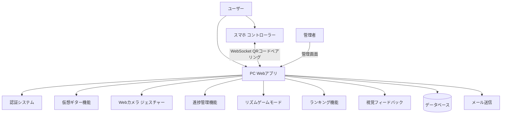
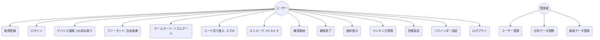

# 要件定義書

## はじめに

### プロダクトステートメント
VirtuTune（ヴァーチュチューン）は、楽器初心者が直面する「練習の継続困難」「何から始めるかわからない」「モチベーション維持」といった課題を解決する、仮想ギターと進捗管理機能を持つPython Webアプリケーションです。

### 前提条件
このドキュメントでは以下を想定します：
- ユーザーはギターを所有していない初心者である
- ユーザーはモダンなWebブラウザ（Chrome/Safari/Firefoxの最新版）を使用している
- ユーザーは基本的なWeb操作（クリック、タッチ）が可能である
- MVP（Minimum Viable Product）では音声認証機能は除外する
- リマインダー機能はメール通知のみ実装し、プッシュ通知は今後の拡張とする

### 対象ペルソナ

**ペルソナ1: ギター初心者（主要ターゲット）**
- 楽器を全く持っていない
- 「ギターを始めたい」と思っているが、何から手を付けていいかわからない
- 短時間で気楽に体験したい

**ペルソナ2: 挫組経験者**
- 以前ギターを始めたが、Fコードなどの技術的な壁で挫折した
- もう一度挑戦したいが、同じ失敗を繰り返したくない

**ペルソナ3: 継続したい学習者**
- 基本的なコードは弾ける
- 毎日の練習習慣をつけたいが、モチベーションが続かない

---

## システム概要

### システムコンテキスト

### ユースケース図

---

## 機能要件

### ペルソナ要件マトリックス

| 要件 | ペルソナ1 (初心者) | ペルソナ2 (挫折経験) | ペルソナ3 (継続したい) | 優先度 |
|------|:---:|:---:|:---:|:---:|
| 要件1: 仮想ギター演奏機能 | 🔴 | 🔴 | - | 高 |
| 要件2: 練習時間記録機能 | 🔴 | 🔴 | 🔴 | 高 |
| 要件3: 進捗表示機能 | - | ⚪️ | 🔴 | 高 |
| 要件4: 目標設定機能 | - | ⚪️ | 🔴 | 中 |
| 要件5: 練習リマインダー機能 | - | ⚪️ | 🔴 | 中 |
| 要件6: ユーザー認証機能 | 🔴 | 🔴 | 🔴 | 高 |
| 要件7: プロフィール管理機能 | 🔴 | 🔴 | 🔴 | 中 |
| 要件8: ランディングページ | 🔴 | 🔴 | 🔴 | 中 |
| 要件9: スマホPC連携機能 | ⚪️ | 🔴 | - | 高 |
| 要件10: カメラジェスチャー機能 | ⚪️ | 🔴 | - | 高 |
| 要件11: リズムゲームモード | 🔴 | - | 🔴 | 高 |
| 要件12: 視覚フィードバック機能 | ⚪️ | ⚪️ | 🔴 | 中 |
| 要件13: ランキング機能 | 🔴 | - | ⚪️ | 中 |

🔴=強いニーズ, ⚪️=弱いニーズ, -=対象外

---

### 要件1: 仮想ギター演奏機能

**優先度:** 高
**対象ペルソナ:** ペルソナ1（ギター初心者）、ペルソナ2（挫折経験者）

**ユーザーストーリー:**
楽器を持っていない初心者として、楽器を買わずにブラウザでギターを演奏したい。なぜなら、まずは気軽にギター体験をし、自分に合うか確認したいから

**解決する課題:**
- 「ギターを買ってみたものの、続かなかった」という失敗の回避
- 「何から手を付けていいかわからない」という初心者の不安の解消

#### 受け入れ基準
1. Webブラウザ上で6本弦のギターが表示される
2. 各弦をクリックまたはタップすると、音が鳴り、弦が振動するアニメーションが表示される
3. 8種類以上の基本コード（C、G、Am、F、D、E、Em、A等）を選択できる
4. 選択したコードに対応する押弦位置（コードダイアグラム）が表示される
5. コードを切り替えると、指の位置が更新される
6. 弦を鳴らした際のレスポンスは100ms以内である

#### 備考
- 最初はオープンコードのみ対応
- 将来の拡張でバレーコードにも対応予定

---

### 要件2: 練習時間記録機能

**優先度:** 高
**対象ペルソナ:** ペルソナ1（ギター初心者）、ペルソナ2（挫折経験者）、ペルソナ3（継続したい学習者）

**ユーザーストーリー:**
練習を続けたい学習者として、自分がどれくらい練習しているか記録したい。なぜなら、練習の積み重ねを可視化することで「自分も少しずつ上達している」と実感し、モチベーションを維持したいから

**解決する課題:**
- 「今日どれくらい練習したっけ？」という記録の手間を省く
- 「練習しているのに上達している気がしない」という不安の解消

#### 受け入れ基準
1. 仮想ギター画面に「練習開始」ボタンがある
2. 練習開始ボタンを押すと、タイマーが開始される
3. 「練習終了」ボタンを押すと、そのセッションの練習時間が記録される
4. 練習時間は秒単位で記録される
5. 練習中に使用したコードが記録される

#### 備考
- タイマーはリアルタイムで画面に表示される
- 不意のブラウザ閉じに対処するため、定期的に一時保存を行う

---

### 要件3: 進捗表示機能

**優先度:** 高
**対象ペルソナ:** ペルソナ3（継続したい学習者）

**ユーザーストーリー:**
毎日の練習を習慣化したい学習者として、自分の進捗をグラフで確認したい。なぜなら、毎日の積み重ねを視覚的に実感することで「今日も練習しよう」という継続意欲を高めたいから

**解決する課題:**
- 「練習しているけど効果が出ているのかわからない」というモチベーション低下の防止
- 連続練習日数（ストリーク）の可視化による「途切れさせたくない」という心理的動機付け

#### 受け入れ基準
1. 過去7日間の練習時間をグラフで表示する
2. 過去30日間の練習時間をグラフで表示する
3. 総練習時間を表示する
4. 連続練習日数（ストリーク）を表示する
5. 今日の練習時間を表示する
6. 目標達成状況を視覚的に表示する

#### 備考
- グラフはChart.js等のライブラリを使用
- レスポンシブデザインでモバイルでも見やすい

---

### 要件4: 目標設定機能

**優先度:** 中
**対象ペルソナ:** ペルソナ3（継続したい学習者）

**ユーザーストーリー:**
無理なく練習を続けたい学習者として、1日の目標練習時間を設定したい。なぜなら、自分のペースに合わせて「今日は5分だけでも」という小さな目標を設定することで、ハードルを下げて練習を継続したいから

**解決する課題:**
- 「毎日1時間練習しなきゃ」というハードルの高さによる挫折の防止
- 「今日は少しだけでもできた」という小さな成功体験の積み重ね

#### 受け入れ基準
1. ユーザーは1日の目標練習時間（分単位）を設定できる
2. デフォルト値は5分である
3. 目標達成時に視覚的なフィードバックが表示される
4. 目標未達成の場合、励ましのメッセージが表示される

---

### 要件5: 練習リマインダー機能

**優先度:** 中
**対象ペルソナ:** ペルソナ3（継続したい学習者）

**ユーザーストーリー:**
忙しい日常の中でも練習を習慣化したい学習者として、練習リマインダーを受け取りたい。なぜなら、「練習しようと思っていたけど忘れていた」という状況を防ぎ、習慣化をサポートしてほしいから

**解決する課題:**
- 忙しい日常の中で「練習するのを忘れてしまう」という問題の解消
- ストリークが途切れることへの不安の軽減（警告メールによるリマインド）

#### 受け入れ基準
1. ユーザーはリマインダーのON/OFFを設定できる
2. ユーザーはリマインダー送信時刻を設定できる
3. 設定した時刻に練習リマインダーメールが送信される
4. 連続で練習していない日数が増えると、警告メールが送信される

#### 備考
- メール送信にはDjangoのメール機能を使用
- Celery等のタスクキューで定期実行

---

### 要件6: ユーザー認証機能

**優先度:** 高
**対象ペルソナ:** すべてのペルソナ

**ユーザーストーリー:**
サービスを利用するユーザーとして、アカウントを作成してログインしたい。なぜなら、自分の練習記録や進捗を個人別に管理し、自分専用の成長軌跡を残したいから

#### 受け入れ基準
1. ユーザーはメールアドレスとパスワードで新規登録できる
2. ユーザーはメールアドレスとパスワードでログインできる
3. ユーザーはログアウトできる
4. パスワードを忘れた場合、リセットメールを送信できる
5. 未ログイン状態で保護されたページにアクセスすると、ログイン画面にリダイレクトされる

#### 備考
- Djangoの認証システムを使用
- パスワードはハッシュ化して保存

---

### 要件7: プロフィール管理機能

**優先度:** 中
**対象ペルソナ:** すべてのペルソナ

**ユーザーストーリー:**
サービスを利用するユーザーとして、自分のプロフィールを管理したい。なぜなら、目標練習時間やリマインダー時刻など、自分のライフスタイルに合わせて設定をカスタマイズしたいから

#### 受け入れ基準
1. ユーザーはユーザー名を変更できる
2. ユーザーは1日の目標練習時間を変更できる
3. ユーザーはリマインダー設定を変更できる
4. ユーザーはアカウントを削除できる

---

### 要件8: ランディングページ

**優先度:** 中
**対象ペルソナ:** すべてのペルソナ（初回訪問時）

**ユーザーストーリー:**
初めて訪問したユーザーとして、このサービスの概要を知りたい。なぜなら、どんなサービスか、自分にとって役に立つかを判断し、利用を開始するかどうかを決めたいから

#### 受け入れ基準
1. サービスの概要が表示される
2. 新規登録ボタンがある
3. ログインボタンがある
4. サービスの特徴がわかる説明がある

---

### 要件9: スマホPC連携機能

**優先度:** 高
**対象ペルソナ:** ペルソナ2（挫折経験者）

**ユーザーストーリー:**
以前ギターで挫折した経験があるユーザーとして、スマホ（左手操作）とPC（右手操作）を連携させて演奏したい。なぜなら、実際のギターに近い「左手でコードを押さえ、右手でストロークする」という操作感を再現することで、前回とは違う感覚で練習を続けたいから

**解決する課題:**
- 「左手の指が痛くて続けられない」というFコード等の挫折要因の回避
- 「実際のギターの操作感を体験したい」という欲求の満たし

#### 受け入れ基準
1. PC画面にQRコードが表示される
2. スマホでQRコードを読み取るとWebSocket接続が確立される
3. スマホは左手操作（コード選択）用のコントローラー画面を表示する
4. PCは右手操作（ストローク判定）用のカメラ画面を表示する
5. 接続状態がリアルタイムに同期される

#### 備考
- QRコードはセッションごとに生成される
- WebSocket通信で低遅延を実現
- 接続解除の方法（終了ボタン）を提供

---

### 要件10: カメラジェスチャー機能

**優先度:** 高
**対象ペルソナ:** ペルソナ2（挫折経験者）

**ユーザーストーリー:**
PCのWebカメラを使って右手のストローク動作を検知したい。なぜなら、実際のギターのストローク感を再現することで、よりリアルな演奏体験を得たいから

**解決する課題:**
- 「マウスをクリックするだけでは弾いている感じがしない」という不満の解消
- 手の動きに応じた音量やニュアンスの変化による表現力の向上

#### 受け入れ基準
1. PCのWebカメラへのアクセス許可を取得する
2. MediaPipe Handsを使って手の動きをリアルタイムに検知する
3. ストローク動作（手が下に動く）を検知したらギター音を鳴らす
4. 手の位置、速度、タイミングを認識する
5. カメラ映像は処理後に即座に破棄する（プライバシー配慮）

#### 備考
- MediaPipe Hands (Google) を使用
- カメラ解像度: 640x480程度で十分
- 検出遅延: 100ms以内を目標
- カメラ未使用時はLEDを消灯してプライバシーを配慮

---

### 要件11: リズムゲームモード

**優先度:** 高
**対象ペルソナ:** ペルソナ1（ギター初心者）、ペルソナ3（継続したい学習者）

**ユーザーストーリー:**
初心者として、ゲーム感覚で楽しくリズム練習をしたい。なぜなら、遊びながら練習することで「楽しい」という感情を味わい、継続意欲を高めたいから

**解決する課題:**
- 「ただ練習するだけでは退屈」という飽きの解消
- 「いつタイミングよく弾けばいいかわからない」というリズム感の習得
- ゲーム的な報酬（スコア、コンボ）によるモチベーション維持

#### 受け入れ基準
1. ゲームモードとフリーモンモードの切り替えができる
2. 音符が画面上を流れる（Guitar Hero風）
3. タイミングよく弦を操作（タップ/ストローク）するとスコアが加算される
4. コンボ率（正解率）がリアルタイムで表示される
5. 曲の進行に応じて難易度が変化する
6. ステージクリア時の演出を表示する

#### 備考
- 音符タイミングの可視化: ■■■□□ のようなバー
- 音楽データはシーケンスデータとして保存
- 既存曲とオリジナル曲に対応
- 難易度は「初心者向け」に調整

---

### 要件12: 視覚フィードバック機能

**優先度:** 中
**対象ペルソナ:** ペルソナ3（継続したい学習者）

**ユーザーストーリー:**
視覚的な刺激を通して、リズムの感覚を掴みたい。なぜなら、音だけではなく視覚的なフィードバックがあることで、演奏のタイミングが直感的にわかり、「弾ける」という感覚を得やすいから

**解決する課題:**
- 「いつタイミングよく弾けばいいかわからない」というリズム習得の困難さの解消
- 視覚的な演出による「弾けた！」という達成感の強化
- 音波アニメーションによる「音と動きの連動」感覚の醸成

#### 受け入れ基準
1. 弦を鳴らした際に発光アニメーションが表示される
2. 音の波形がビジュアルエフェクトとして表示される
3. 完璧な演奏時に「パーフェクト」演出が表示される
4. ミス時に「グレート」演出が表示される
5. 目標達成時に背景全体がグラデーションで光る

#### 備考
- CSS Animation / Canvas / WebGL を使用
- 音声に合わせたリアルタイム波形表示
- パーティクルエフェクトで祝う演出

---

### 要件13: ランキング機能

**優先度:** 中
**対象ペルソナ:** ペルソナ1（ギター初心者）

**ユーザーストーリー:**
初心者として、他のユーザーと競い合うことで、モチベーションを維持したい。なぜなら、同じ初心者同士で成長を競い合ったり、上位者のスコアを見ることで「自分ももっと上達したい」という意欲を湧かせたいから

**解決する課題:**
- 「一人で練習していて、自分のレベルがわからない」という不安の解消
- 社会的要素（ランキング、実績バッジ）による「続けたい」という動機付け
- 他のユーザーとの比較による「自分も順位を上げたい」という競争心の刺激

#### 受け入れ基準
1. 日次スコアランキングを表示する
2. 週間スコアランキングを表示する
3. ユーザー名はランダムなハンドルネームで表示（プライバシー配慮）
4. 実績（バッジ）システムが存在する
5. ランキング上位には特別な称号が付与される

#### 備考
- ゲームモードのスコアと連動
- 順位は24時間ごとに更新
- 不正行為対策（スコアの検証）
- 自分のランク位置が強調表示される

---

## 非機能要件

### パフォーマンス要件
- 仮想ギター操作（弦を鳴らす）のレスポンス: 100ms以内
- ページ読み込み時間: 2秒以内
- 進捗グラフの描画: 1秒以内
- 同時接続ユーザー: 初期は100人、将来的に1000人以上対応

### セキュリティ要件
- パスワードはPBKDF2 + SHA256（Django標準）でハッシュ化して保存
- CSRF対策を適用する
- SQLインジェクション対策を適用する（ORM使用）
- HTTPS対応（本番環境）
- セッションハイジャック対策
- セッションタイムアウト: ブラウザを閉じると無効、または1時間で無効
- **レート制限**:
  - ログイン試行: 1分間に5回まで
  - APIリクエスト: 1分間に60回まで
  - サインアップ: 1時間に3回まで（同一IP）
- パスワードリセットトークン有効期限: 1時間
- セキュリティヘッダー: HSTS、X-Frame-Options、CSPを設定

### ユーザビリティ要件
- モバイルファーストでレスポンシブデザイン
- タッチ操作最適化
- 直感的なUI/UX
- 適切なコントラスト比（WCAG 2.1 AA準拠）
- キーボード操作対応

### スケーラビリティ要件
- データベースはSQLiteからPostgreSQLへの移行を見越した設計
- 静的ファイルはCDN配信を考慮
- 将来的にサーバーレス化を見越した状態管理

### 可用性要件
- 初期は99%の稼働率を目標
- 定期的なデータバックアップ

---

## 開発者要件

### テスト要件
- ユニットテストカバレッジ: 80%以上
- 主要機能の統合テスト
- 回帰テストスイート

### ドキュメント要件
- APIドキュメント（OpenAPI/Swagger）
- 開発者セットアップガイド（README.md）
- コメントは日本語で記述

### 保守性要件
- PEP 8準拠のコーディング規約
- Blackによるコードフォーマット
- flake8によるリンティング
- 型ヒント（Type Hints）の使用

### CI/CD要件
- 自動テスト実行
- 自動デプロイ（将来的）

---

## 制約と依存関係

### 技術的制約
- バックエンド: Python 3.11+, Django 5.0+
- フロントエンド: HTML5, CSS3, JavaScript (ES6+)
- データベース: 開発はSQLite、本番はPostgreSQL

### リソース制約
- 開発チーム: 1名（初期）
- 開発期間: 未定

### 外部依存関係
- メールサーバー（SMTP）
- 将来的に: 音声認識API、決済ゲートウェイ

---

## 成功指標

### 定量的指標
- MVP完了: 仮想ギター機能と進捗管理機能が動作する
- テストカバレッジ: 80%以上
- ページ読み込み速度: 2秒以内

### 定性的指標
- 初心者が直感的に操作できる
- 練習継続のモチベーション向上
- コードの可読性と保守性

---

## 用語集

| 用語 | 説明 |
|------|------|
| オープンコード | 開放弦を含む基本的なコードフォーム |
| バレーコード | 人差し指で複数の弦を押さえるコード（Fコードなど） |
| ストリーク | 連続して練習した日数 |
| コードダイアグラム | コードの押弦位置を示した図解 |
| セーハ | バレーコードを押さえる技術 |
| MVP | Minimum Viable Product（実用最小限の製品） |

---

## 優先度マトリックス

| 要件 | 優先度 | 工数 | リスク |
|------|--------|------|--------|
| 仮想ギター演奏機能 | 高 | 中 | 低 |
| 練習時間記録機能 | 高 | 低 | 低 |
| 進捗表示機能 | 高 | 中 | 中 |
| 目標設定機能 | 中 | 低 | 低 |
| 練習リマインダー機能 | 中 | 中 | 中 |
| ユーザー認証機能 | 高 | 低 | 低 |
| プロフィール管理機能 | 中 | 低 | 低 |
| ランディングページ | 中 | 低 | 低 |
