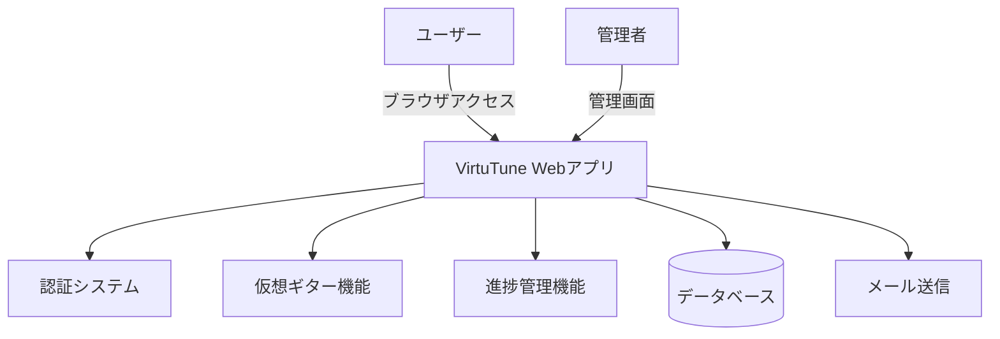
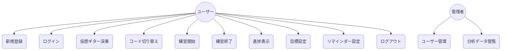

# 要件定義書

## はじめに

### プロダクトステートメント
VirtuTune（ヴァーチュチューン）は、楽器初心者が直面する「練習の継続困難」「何から始めるかわからない」「モチベーション維持」といった課題を解決する、仮想ギターと進捗管理機能を持つPython Webアプリケーションです。

### 前提条件
このドキュメントでは以下を想定します：
- ユーザーはギターを所有していない初心者である
- ユーザーはモダンなWebブラウザ（Chrome/Safari/Firefoxの最新版）を使用している
- ユーザーは基本的なWeb操作（クリック、タッチ）が可能である
- MVP（Minimum Viable Product）では音声認証機能は除外する
- リマインダー機能はメール通知のみ実装し、プッシュ通知は今後の拡張とする

### 対象ペルソナ

**ペルソナ1: ギター初心者（主要ターゲット）**
- 楽器を全く持っていない
- 「ギターを始めたい」と思っているが、何から手を付けていいかわからない
- 短時間で気楽に体験したい

**ペルソナ2: 挫組経験者**
- 以前ギターを始めたが、Fコードなどの技術的な壁で挫折した
- もう一度挑戦したいが、同じ失敗を繰り返したくない

**ペルソナ3: 継続したい学習者**
- 基本的なコードは弾ける
- 毎日の練習習慣をつけたいが、モチベーションが続かない

---

## システム概要

### システムコンテキスト

### ユースケース図

---

## 機能要件

### 要件1: 仮想ギター演奏機能

**優先度:** 高
**ユーザーストーリー:** ギター初心者として、楽器を買わずにブラウザでギターを演奏したい。なぜなら、まずは気軽にギター体験をしたいから

#### 受け入れ基準
1. Webブラウザ上で6本弦のギターが表示される
2. 各弦をクリックまたはタップすると、音が鳴り、弦が振動するアニメーションが表示される
3. 8種類以上の基本コード（C、G、Am、F、D、E、Em、A等）を選択できる
4. 選択したコードに対応する押弦位置（コードダイアグラム）が表示される
5. コードを切り替えると、指の位置が更新される
6. 弦を鳴らした際のレスポンスは100ms以内である

#### 備考
- 最初はオープンコードのみ対応
- 将来の拡張でバレーコードにも対応予定

---

### 要件2: 練習時間記録機能

**優先度:** 高
**ユーザーストーリー:** 練習習慣を身につけたい学習者として、自分の練習時間を記録したい。なぜなら、進捗を可視化することでモチベーションを維持したいから

#### 受け入れ基準
1. 仮想ギター画面に「練習開始」ボタンがある
2. 練習開始ボタンを押すと、タイマーが開始される
3. 「練習終了」ボタンを押すと、そのセッションの練習時間が記録される
4. 練習時間は秒単位で記録される
5. 練習中に使用したコードが記録される

#### 備考
- タイマーはリアルタイムで画面に表示される
- 不意のブラウザ閉じに対処するため、定期的に一時保存を行う

---

### 要件3: 進捗表示機能

**優先度:** 高
**ユーザーストーリー:** 練習習慣を身につけたい学習者として、自分の進捗をグラフで確認したい。なぜなら、自分の成長を視覚的に確認することで継続意欲を高めたいから

#### 受け入れ基準
1. 過去7日間の練習時間をグラフで表示する
2. 過去30日間の練習時間をグラフで表示する
3. 総練習時間を表示する
4. 連続練習日数（ストリーク）を表示する
5. 今日の練習時間を表示する
6. 目標達成状況を視覚的に表示する

#### 備考
- グラフはChart.js等のライブラリを使用
- レスポンシブデザインでモバイルでも見やすい

---

### 要件4: 目標設定機能

**優先度:** 中
**ユーザーストーリー:** 練習習慣を身につけたい学習者として、1日の目標練習時間を設定したい。なぜなら、目標があることで練習を続けやすいから

#### 受け入れ基準
1. ユーザーは1日の目標練習時間（分単位）を設定できる
2. デフォルト値は5分である
3. 目標達成時に視覚的なフィードバックが表示される
4. 目標未達成の場合、励ましのメッセージが表示される

---

### 要件5: 練習リマインダー機能

**優先度:** 中
**ユーザーストーリー:** 継続したい学習者として、練習リマインダーを受け取りたい。なぜなら、忙しいとつい練習を忘れてしまうから

#### 受け入れ基準
1. ユーザーはリマインダーのON/OFFを設定できる
2. ユーザーはリマインダー送信時刻を設定できる
3. 設定した時刻に練習リマインダーメールが送信される
4. 連続で練習していない日数が増えると、警告メールが送信される

#### 備考
- メール送信にはDjangoのメール機能を使用
- Celery等のタスクキューで定期実行

---

### 要件6: ユーザー認証機能

**優先度:** 高
**ユーザーストーリー:** サービスを利用するユーザーとして、アカウントを作成してログインしたい。なぜなら、自分の進捗を個人管理したいから

#### 受け入れ基準
1. ユーザーはメールアドレスとパスワードで新規登録できる
2. ユーザーはメールアドレスとパスワードでログインできる
3. ユーザーはログアウトできる
4. パスワードを忘れた場合、リセットメールを送信できる
5. 未ログイン状態で保護されたページにアクセスすると、ログイン画面にリダイレクトされる

#### 備考
- Djangoの認証システムを使用
- パスワードはハッシュ化して保存

---

### 要件7: プロフィール管理機能

**優先度:** 中
**ユーザーストーリー:** サービスを利用するユーザーとして、自分のプロフィールを管理したい。なぜなら、目標や設定を自分好みにカスタマイズしたいから

#### 受け入れ基準
1. ユーザーはユーザー名を変更できる
2. ユーザーは1日の目標練習時間を変更できる
3. ユーザーはリマインダー設定を変更できる
4. ユーザーはアカウントを削除できる

---

### 要件8: ランディングページ

**優先度:** 中
**ユーザーストーリー:** 初めて訪問したユーザーとして、このサービスの概要を知りたい。なぜなら、どんなサービスか判断したいから

#### 受け入れ基準
1. サービスの概要が表示される
2. 新規登録ボタンがある
3. ログインボタンがある
4. サービスの特徴がわかる説明がある

---

## 非機能要件

### パフォーマンス要件
- 仮想ギター操作（弦を鳴らす）のレスポンス: 100ms以内
- ページ読み込み時間: 2秒以内
- 進捗グラフの描画: 1秒以内
- 同時接続ユーザー: 初期は100人、将来的に1000人以上対応

### セキュリティ要件
- パスワードはPBKDF2 + SHA256（Django標準）でハッシュ化して保存
- CSRF対策を適用する
- SQLインジェクション対策を適用する（ORM使用）
- HTTPS対応（本番環境）
- セッションハイジャック対策
- セッションタイムアウト: ブラウザを閉じると無効、または1時間で無効
- **レート制限**:
  - ログイン試行: 1分間に5回まで
  - APIリクエスト: 1分間に60回まで
  - サインアップ: 1時間に3回まで（同一IP）
- パスワードリセットトークン有効期限: 1時間
- セキュリティヘッダー: HSTS、X-Frame-Options、CSPを設定

### ユーザビリティ要件
- モバイルファーストでレスポンシブデザイン
- タッチ操作最適化
- 直感的なUI/UX
- 適切なコントラスト比（WCAG 2.1 AA準拠）
- キーボード操作対応

### スケーラビリティ要件
- データベースはSQLiteからPostgreSQLへの移行を見越した設計
- 静的ファイルはCDN配信を考慮
- 将来的にサーバーレス化を見越した状態管理

### 可用性要件
- 初期は99%の稼働率を目標
- 定期的なデータバックアップ

---

## 開発者要件

### テスト要件
- ユニットテストカバレッジ: 80%以上
- 主要機能の統合テスト
- 回帰テストスイート

### ドキュメント要件
- APIドキュメント（OpenAPI/Swagger）
- 開発者セットアップガイド（README.md）
- コメントは日本語で記述

### 保守性要件
- PEP 8準拠のコーディング規約
- Blackによるコードフォーマット
- flake8によるリンティング
- 型ヒント（Type Hints）の使用

### CI/CD要件
- 自動テスト実行
- 自動デプロイ（将来的）

---

## 制約と依存関係

### 技術的制約
- バックエンド: Python 3.11+, Django 5.0+
- フロントエンド: HTML5, CSS3, JavaScript (ES6+)
- データベース: 開発はSQLite、本番はPostgreSQL

### リソース制約
- 開発チーム: 1名（初期）
- 開発期間: 未定

### 外部依存関係
- メールサーバー（SMTP）
- 将来的に: 音声認識API、決済ゲートウェイ

---

## 成功指標

### 定量的指標
- MVP完了: 仮想ギター機能と進捗管理機能が動作する
- テストカバレッジ: 80%以上
- ページ読み込み速度: 2秒以内

### 定性的指標
- 初心者が直感的に操作できる
- 練習継続のモチベーション向上
- コードの可読性と保守性

---

## 用語集

| 用語 | 説明 |
|------|------|
| オープンコード | 開放弦を含む基本的なコードフォーム |
| バレーコード | 人差し指で複数の弦を押さえるコード（Fコードなど） |
| ストリーク | 連続して練習した日数 |
| コードダイアグラム | コードの押弦位置を示した図解 |
| セーハ | バレーコードを押さえる技術 |
| MVP | Minimum Viable Product（実用最小限の製品） |

---

## 優先度マトリックス

| 要件 | 優先度 | 工数 | リスク |
|------|--------|------|--------|
| 仮想ギター演奏機能 | 高 | 中 | 低 |
| 練習時間記録機能 | 高 | 低 | 低 |
| 進捗表示機能 | 高 | 中 | 中 |
| 目標設定機能 | 中 | 低 | 低 |
| 練習リマインダー機能 | 中 | 中 | 中 |
| ユーザー認証機能 | 高 | 低 | 低 |
| プロフィール管理機能 | 中 | 低 | 低 |
| ランディングページ | 中 | 低 | 低 |
