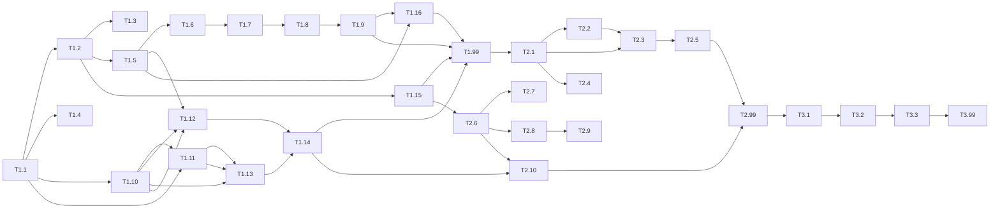

# 実装計画

## 概要

VirtuTuneの実装は、まず仮想ギター機能と進捗管理機能、スマホPC連携機能、カメラジェスチャー機能を持つMVP（Minimum Viable Product）を構築し、その後リマインダー機能、リズムゲームモード、ランキング機能などの追加機能を実装します。Djangoプロジェクトを機能単位のアプリに分割し、段階的に開発を進めます。

**主要な技術的特徴:**
- **スマホ+PCデュアルデバイス**: 左手（スマホ）でコード選択、右手（PCカメラ）でストローク判定
- **Django Channels**: WebSocketによるリアルタイム通信
- **MediaPipe Hands**: カメラジェスチャー認識
- **リズムゲーム**: Guitar Hero風の音符フローとスコアシステム
- **ランキング**: 日次・週間ランキングと実績バッジシステム

---

## 実行体制

### リーダー: Claude (Main)

**役割:**
- 全体の進捗管理と統括
- サブエージェント間の調整
- コードレビューと品質確認
- 最終的な統合とテスト

### サブエージェント編成

| エージェント | 役割 | 対象ペルソナ | 担当領域 | タスク |
|------------|------|-------------|---------|------|
| **Sub-Agent-1** | バックエンド基盤 | 全ペルソナ | プロジェクトセットアップ、データモデル、認証 | 1.1, 1.2, 1.3 |
| **Sub-Agent-2** | フロントエンド基盤 | ペルソナ1, 3 | テンプレート、UI/UX、静的リソース | 1.4, 1.5, 1.6, 1.7, 1.8, 1.9 |
| **Sub-Agent-3** | WebSocket/リアルタイム | ペルソナ2 | チャネル設定、QRコード、スマホ連携 | 1.10, 1.11, 1.13 |
| **Sub-Agent-4** | カメラ/メディア | ペルソナ2 | MediaPipe統合、ジェスチャー認識、視覚フィードバック | 1.12, 1.16 |
| **Sub-Agent-5** | ビジネスロジック | ペルソナ3 | 練習記録、進捗管理、ゲームデータモデル | 1.7, 1.8, 1.9, 1.15 |

**ペルソナ別エージェント対応:**
- **ペルソナ1（初心者）**: Sub-Agent-2（フロントエンド）、Sub-Agent-4（ゲーム）が主要担当
- **ペルソナ2（挫折経験者）**: Sub-Agent-3（スマホ連携）が主要担当、左手タッチ入力を重視
- **ペルソナ3（継続したい）**: Sub-Agent-5（ビジネスロジック）が主要担当、進捗可視化を重視

### 並列実行戦略

#### ステージ1: 基盤構築（順次実行）
```
Sub-Agent-1: タスク1.1（Djangoプロジェクトセットアップ）
    ↓ 完了後
Sub-Agent-1: タスク1.2（データベースモデル）+ Sub-Agent-2: タスク1.4（ランディングページ）
```

#### ステージ2: 並列実行（5エージェント同時稼働）
```
Sub-Agent-1: タスク1.3（ユーザー認証）
Sub-Agent-2: タスク1.5, 1.6（仮想ギター）
Sub-Agent-3: タスク1.10, 1.11（WebSocket, QR）
Sub-Agent-4: タスク1.12（カメラジェスチャー）
Sub-Agent-5: タスク1.15（ゲームデータモデル）
```

#### ステージ3: 機能統合
```
Sub-Agent-2: タスク1.7, 1.8, 1.9（練習記録・進捗）
Sub-Agent-3: タスク1.13（モバイルコントローラー）
Sub-Agent-4: タスク1.16（視覚フィードバック）
```

#### ステージ4: 統合テスト
```
全員: タスク1.14（統合テスト）
```

### 進捗管理

| エージェント | ステージ1 | ステージ2 | ステージ3 | ステージ4 |
|------------|---------|---------|---------|---------|
| Sub-Agent-1 | 1.1, 1.2 | 1.3 | - | レビュー |
| Sub-Agent-2 | 1.4 | 1.5, 1.6 | 1.7, 1.8, 1.9 | レビュー |
| Sub-Agent-3 | - | 1.10, 1.11 | 1.13 | 1.14 |
| Sub-Agent-4 | - | 1.12 | 1.16 | 1.14 |
| Sub-Agent-5 | - | 1.15 | - | レビュー |

### コミット戦略

各エージェントは以下のルールでコミットします：

1. **タスク単位でコミット**: 1タスク完了ごとにコミット
2. **コミットメッセージ形式**:
   ```
   [Agent-X] feat/fix/chore: タスク名

   詳細説明

   Co-Authored-By: Sub-Agent-X <noreply@anthropic.com>
   ```
3. **リーダーがマージ**: メインブランチへのマージはリーダーが確認後に実行

### コミュニケーション

- **進捗報告**: 各エージェントはタスク完了時にリーダーに報告
- **ブロック報告**: 問題発生時は即座にリーダーに報告し、指示を仰ぐ
- **コードレビュー**: 全てのコード変更はリーダーのレビューを経てからマージ

---

## タスクサマリー

| フェーズ | 総タスク数 | 完了 | 進行中 | 未着手 | ブロック中 |
|---------|------------|------|--------|---------|------------|
| フェーズ1 | 16 | 0 | 0 | 16 | 0 |
| フェーズ2 | 10 | 0 | 0 | 10 | 0 |
| フェーズ3 | 3 | 0 | 0 | 3 | 0 |

---

## フェーズ1: MVP（Minimum Viable Product）

### 🔴 タスク 1.1: Djangoプロジェクトセットアップ

**工数:** 2時間
**依存関係:** なし
**対象ペルソナ:** 全ペルソナ（共通基盤）

- [ ] プロジェクトリポジトリを初期化
  - Djangoプロジェクトを作成: `django-admin startproject config`
  - アプリディレクトリ構造を作成
    - `apps/core`
    - `apps/guitar`
    - `apps/progress`
    - `apps/users`
  - .gitignore と README.md をセットアップ
- [ ] 開発環境をセットアップ
  - requirements.txt を作成
    - Django 5.0+
    - django-ratelimit（レート制限用）
  - 仮想環境の設定手順をドキュメント化
  - 環境変数ファイル（.env.example）を作成
    - SECRET_KEY（必須）
    - DB_PASSWORD（必須、本番）
- [ ] コーディング規約を設定
  - Black（フォーマッター）設定
  - flake8（リンター）設定
  - .flake8, pyproject.toml を作成
- [ ] セキュリティ設定を追加
  - セッションタイムアウト: `SESSION_EXPIRE_AT_BROWSER_CLOSE = True`
  - パスワードリセット有効期限: `PASSWORD_RESET_TIMEOUT = 3600`
  - 環境変数バリデーション関数を実装

**要件:** 開発者要件（保守性要件）、セキュリティ要件

---

### 🔴 タスク 1.2: データベースモデル実装

**工数:** 3時間
**依存関係:** タスク 1.1
**対象ペルソナ:** 全ペルソナ（共通データモデル）

- [ ] ユーザーモデルを実装
  ```python
  # apps/users/models.py
  from django.contrib.auth.models import AbstractUser

  class User(AbstractUser):
      daily_goal_minutes = models.IntegerField(default=5)
      reminder_enabled = models.BooleanField(default=False)
      reminder_time = models.TimeField(null=True, blank=True)
      streak_days = models.IntegerField(default=0)
      total_practice_minutes = models.IntegerField(default=0)
  ```
- [ ] 練習セッションモデルを実装
  ```python
  # apps/progress/models.py
  class PracticeSession(models.Model):
      user = models.ForeignKey(User, on_delete=models.CASCADE)
      started_at = models.DateTimeField()
      ended_at = models.DateTimeField(null=True, blank=True)
      duration_minutes = models.IntegerField(default=0)
      chords_practiced = models.JSONField(default=list)
      created_at = models.DateTimeField(auto_now_add=True)
  ```
- [ ] コードモデルを実装
  ```python
  # apps/guitar/models.py
  class Chord(models.Model):
      name = models.CharField(max_length=10, unique=True)
      finger_positions = models.JSONField()
      difficulty = models.IntegerField(default=1)
      diagram = models.TextField(blank=True)
  ```
- [ ] マイグレーションを作成
- [ ] インデックスを作成（user_id, started_at）

**要件:** 要件2（練習時間記録機能）、要件6（ユーザー認証機能）

---

### 🔴 タスク 1.3: ユーザー認証機能実装

**工数:** 3時間
**依存関係:** タスク 1.2
**対象ペルソナ:** 全ペルソナ（認証は全員必須）

- [ ] 認証設定を構成
  ```python
  # config/settings.py
  AUTH_USER_MODEL = 'users.User'
  LOGIN_URL = 'login'
  LOGOUT_REDIRECT_URL = 'index'
  ```
- [ ] サインアップビューを実装
  - `SignUpView` クラスベースビュー
  - フォームバリデーション
  - ユーザー作成と自動ログイン
- [ ] ログイン/ログアウトビューを実装
  - Djangoの組み込みビューを使用
  - カスタムテンプレート
- [ ] 認証関連URLを設定
  ```python
  # apps/users/urls.py
  path('signup/', views.SignUpView.as_view(), name='signup'),
  path('login/', auth_views.LoginView.as_view(), name='login'),
  path('logout/', auth_views.LogoutView.as_view(), name='logout'),
  ```
- [ ] ログイン必須デコレーターを適用

**要件:** 要件6（ユーザー認証機能）

---

### 🔴 タスク 1.4: ランディングページ実装

**工数:** 2時間
**依存関係:** タスク 1.1
**対象ペルソナ:** 全ペルソナ（初回訪問時）

- [ ] ベーステンプレートを作成
  ```html
  <!-- apps/core/templates/core/base.html -->
  
  <!DOCTYPE html>
  <html lang="ja">
  <head>
      <meta charset="UTF-8">
      <meta name="viewport" content="width=device-width, initial-scale=1.0">
      <title>VirtuTune</title>
      <link rel="stylesheet" href="">
  </head>
  <body>
      
      <script src=""></script>
  </body>
  </html>
  ```
- [ ] ランディングページテンプレートを作成
  - サービス概要セクション
  - 新規登録ボタン
  - ログインボタン
  - 特徴説明セクション
- [ ] IndexViewを実装
- [ ] URL設定

**要件:** 要件8（ランディングページ）

---

### 🔴 タスク 1.5: 仮想ギター基本画面実装

**工数:** 4時間
**依存関係:** タスク 1.2, タスク 1.3
**対象ペルソナ:** ペルソナ1（初心者）、ペルソナ2（挫折経験者）

- [ ] ギターページテンプレートを作成
  ```html
  <!-- apps/guitar/templates/guitar/guitar.html -->
  <div class="guitar-container">
      <div class="guitar-neck">
          <!-- 6本弦を描画 -->
          <div class="string" data-string="1"></div>
          <div class="string" data-string="2"></div>
          ...
      </div>
      <div class="chord-selector">
          <!-- コード選択ボタン -->
      </div>
      <div class="practice-controls">
          <button id="start-practice">練習開始</button>
          <button id="stop-practice">練習終了</button>
          <div class="timer">00:00</div>
      </div>
  </div>
  ```
- [ ] GuitarViewを実装
  ```python
  class GuitarView(LoginRequiredMixin, TemplateView):
      template_name = 'guitar/guitar.html'

      def get_context_data(self, **kwargs):
          context = super().get_context_data(**kwargs)
          context['chords'] = Chord.objects.all()
          return context
  ```
- [ ] コードデータをシード
  - 基本コード8種類（C, G, Am, F, D, E, Em, A）
  - finger_positions JSONデータ
- [ ] URL設定

**要件:** 要件1（仮想ギター演奏機能）

---

### 🔴 タスク 1.6: 仮想ギターJavaScript実装

**工数:** 4時間
**依存関係:** タスク 1.5

- [ ] 弦のクリックイベントを実装
  ```javascript
  // static/js/guitar.js
  document.querySelectorAll('.string').forEach(string => {
      string.addEventListener('click', (e) => {
          const stringNumber = e.target.dataset.string;
          playString(stringNumber);
          animateString(e.target);
      });
  });
  ```
- [ ] 音声再生を実装
  ```javascript
  function playString(stringNumber, chord) {
      const audio = new Audio(`/static/sounds/strings/string_${stringNumber}.mp3`);
      audio.play();
  }
  ```
- [ ] 弦振動アニメーションを実装
  ```css
  /* static/css/styles.css */
  @keyframes vibrate {
      0%, 100% { transform: translateY(0); }
      25% { transform: translateY(-2px); }
      75% { transform: translateY(2px); }
  }
  .string.vibrating {
      animation: vibrate 0.1s linear 3;
  }
  ```
- [ ] コード切り替え機能を実装
  ```javascript
  function changeChord(chordName) {
      const chord = chords.find(c => c.name === chordName);
      updateFingerPositions(chord.finger_positions);
  }
  ```

**要件:** 要件1（仮想ギター演奏機能）

---

### 🔴 タスク 1.7: 練習時間記録機能実装

**工数:** 3時間
**依存関係:** タスク 1.5, タスク 1.6

- [ ] 練習開始APIを実装
  ```python
  # apps/guitar/views.py
  @require_POST
  def start_practice(request):
      session = PracticeSession.objects.create(
          user=request.user,
          started_at=timezone.now()
      )
      return JsonResponse({'session_id': session.id})
  ```
- [ ] 練習終了APIを実装
  ```python
  @require_POST
  def end_practice(request):
      data = json.loads(request.body)
      session = PracticeSession.objects.get(id=data['session_id'], user=request.user)
      session.ended_at = timezone.now()
      session.duration_minutes = calculate_duration(session.started_at, session.ended_at)
      session.chords_practiced = data.get('chords', [])
      session.save()
      update_user_stats(request.user, session.duration_minutes)
      return JsonResponse({'success': True})
  ```
- [ ] タイマー機能を実装
  ```javascript
  let practiceStartTime = null;
  let timerInterval = null;

  function startTimer() {
      practiceStartTime = new Date();
      timerInterval = setInterval(updateTimer, 1000);
  }

  function updateTimer() {
      const elapsed = Math.floor((new Date() - practiceStartTime) / 1000);
      const minutes = String(Math.floor(elapsed / 60)).padStart(2, '0');
      const seconds = String(elapsed % 60).padStart(2, '0');
      document.querySelector('.timer').textContent = `${minutes}:${seconds}`;
  }
  ```
- [ ] 使用コードの記録を実装
  ```javascript
  let practicedChords = new Set();

  function recordChord(chordName) {
      practicedChords.add(chordName);
  }
  ```

**要件:** 要件2（練習時間記録機能）

---

### 🔴 タスク 1.8: 進捗表示機能実装

**工数:** 4時間
**依存関係:** タスク 1.7

- [ ] ProgressServiceを実装
  ```python
  # apps/progress/services.py
  class ProgressService:
      @staticmethod
      def get_daily_stats(user, days=7):
          """過去N日間の練習時間を取得"""
          pass

      @staticmethod
      def get_total_stats(user):
          """総練習時間、ストリーク等の統計を取得"""
          pass

      @staticmethod
      def calculate_streak(user):
          """連続練習日数を計算"""
          pass
  ```
- [ ] ProgressViewを実装
  ```python
  class ProgressView(LoginRequiredMixin, TemplateView):
      template_name = 'progress/progress.html'

      def get_context_data(self, **kwargs):
          context = super().get_context_data(**kwargs)
          context['daily_stats'] = ProgressService.get_daily_stats(self.request.user, 7)
          context['total_stats'] = ProgressService.get_total_stats(self.request.user)
          return context
  ```
- [ ] 進捗ページテンプレートを作成
  ```html
  <div class="stats-summary">
      <div class="stat-card">
          <span class="stat-label">今日の練習</span>
          <span class="stat-value">{{ today_minutes }}分</span>
      </div>
      <div class="stat-card">
          <span class="stat-label">連続日数</span>
          <span class="stat-value">{{ streak_days }}日</span>
      </div>
  </div>
  <canvas id="progress-chart"></canvas>
  ```
- [ ] Chart.jsでグラフ描画を実装

**要件:** 要件3（進捗表示機能）

---

### 🔴 タスク 1.9: 目標設定機能実装

**工数:** 2時間
**依存関係:** タスク 1.8
**対象ペルソナ:** ペルソナ3（継続したい学習者）

- [ ] 目標達成チェックを実装
  ```python
  def check_goal_achievement(user):
      today_minutes = PracticeSession.objects.filter(
          user=user,
          started_at__date=timezone.now().date()
      ).aggregate(total=models.Sum('duration_minutes'))['total'] or 0

      return {
          'achieved': today_minutes >= user.daily_goal_minutes,
          'today_minutes': today_minutes,
          'goal_minutes': user.daily_goal_minutes
      }
  ```
- [ ] 進捗ページに目標状況を表示
- [ ] 目標達成時の視覚的フィードバックを実装
  ```css
  .goal-achieved {
      background: linear-gradient(135deg, #667eea 0%, #764ba2 100%);
      animation: celebrate 0.5s ease;
  }
  ```
- [ ] 目標未達成時の励ましメッセージを表示

**要件:** 要件4（目標設定機能）

---

### 🔴 タスク 1.10: Django ChannelsセットアップとWebSocket実装

**工数:** 4時間
**依存関係:** タスク 1.1
**対象ペルソナ:** ペルソナ2（挫折経験者）向けのスマホPC連携基盤

- [ ] Django Channelsをインストール
  ```bash
  pip install channels channels-redis
  ```
- [ ] ASGI設定を構成
  ```python
  # config/asgi.py
  import os
  from django.core.asgi import get_asgi_application
  from channels.routing import ProtocolTypeRouter

  os.environ.setdefault('DJANGO_SETTINGS_MODULE', 'config.settings')
  application = ProtocolTypeRouter({
      "http": get_asgi_application(),
      "websocket": AuthMiddlewareStack(URLRouter(routing.websocket_urlpatterns)),
  })
  ```
- [ ] Redisチャネルレイヤー設定
- [ ] WebSocketConsumerを実装
  ```python
  # apps/websocket/consumers.py
  class GuitarConsumer(AsyncWebsocketConsumer):
      async def connect(self):
          self.session_id = self.scope['url_route']['kwargs']['session_id']
          await self.accept()

      async def receive(self, text_data):
          data = json.loads(text_data)
          if data['type'] == 'chord_change':
              await self.channel_layer.group_send(...)
  ```
- [ ] WebSocketルーティング設定

**要件:** 要件9（スマホPC連携機能）

---

### 🔴 タスク 1.11: QRコードペアリング実装

**工数:** 3時間
**依存関係:** タスク 1.10
**対象ペルソナ:** ペルソナ2（挫折経験者）向けのデバイス連携

- [ ] qrcodeライブラリをインストール
- [ ] QRコード生成APIを実装
  ```python
  # apps/mobile/views.py
  def generate_qr_code(request):
      session_id = str(uuid.uuid4())
      qr = qrcode.make(session_id)
      buffer = io.BytesIO()
      qr.save(buffer, format='PNG')
      return HttpResponse(buffer.getvalue(), content_type='image/png')
  ```
- [ ] セッション管理を実装
- [ ] PC画面にQRコード表示
- [ ] スマホ側QR読み取り実装

**要件:** 要件9（スマホPC連携機能）

---

### 🔴 タスク 1.12: カメラジェスチャー認識実装

**工数:** 6時間
**依存関係:** タスク 1.5
**対象ペルソナ:** ペルソナ2（挫折経験者）向けのリアルな演奏体験

- [ ] MediaPipe Handsライブラリ統合
  ```html
  <script src="https://cdn.jsdelivr.net/npm/@mediapipe/camera_utils/camera_utils.js" crossorigin="anonymous"></script>
  <script src="https://cdn.jsdelivr.net/npm/@mediapipe/control_utils/control_utils.js" crossorigin="anonymous"></script>
  <script src="https://cdn.jsdelivr.net/npm/@mediapipe/drawing_utils/drawing_utils.js" crossorigin="anonymous"></script>
  <script src="https://cdn.jsdelivr.net/npm/@mediapipe/hands/hands.js" crossorigin="anonymous"></script>
  ```
- [ ] GestureRecognizerクラスを実装
  ```javascript
  // static/js/camera.js
  class GestureRecognizer {
      async startCamera(videoElement) { ... }
      onResults(results) { ... }
      isStrumming(current, previous) { ... }
      triggerNote(velocity) { ... }
  }
  ```
- [ ] カメラアクセス許可実装
- [ ] プライバシー配慮（即時破棄）実装
- [ ] PC画面にカメラ映像を表示

**要件:** 要件10（カメラジェスチャー機能）

---

### 🔴 タスク 1.13: モバイルコントローラー実装

**工数:** 4時間
**依存関係:** タスク 1.11
**対象ペルソナ:** ペルソナ2（挫折経験者）向けの左手タッチ入力

- [ ] モバイルコントローラー画面を作成
  ```html
  <!-- apps/mobile/templates/mobile/controller.html -->
  <div class="controller">
      <div class="status">接続中</div>
      <div class="chord-grid">
          <button data-chord="C">C</button>
          <button data-chord="G">G</button>
          <button data-chord="Am">Am</button>
          ...
      </div>
  </div>
  ```
- [ ] WebSocket接続実装
  ```javascript
  const ws = new WebSocket(`ws://localhost:8000/ws/guitar/${sessionId}/`);
  ws.onmessage = (event) => {
      const data = JSON.parse(event.data);
      // PC側の状態を反映
  };
  ```
- [ ] コード変更イベント送信実装
- [ ] レスポンシブデザイン（モバイル最適化）

**要件:** 要件9（スマホPC連携機能）

---

### 🔴 タスク 1.14: スマホPC連携統合テスト

**工数:** 2時間
**依存関係:** タスク 1.10, 1.12, 1.13
**対象ペルソナ:** ペルソナ2（挫折経験者）向けの機能統合検証

- [ ] QRコード読み取り～WebSocket接続フローをテスト
- [ ] スマホコード変更→PC音声再生フローをテスト
- [ ] カメラストローク→音声再生フローをテスト
- [ ] 遅延測定（目標: 100ms以内）
- [ ] 接続切断・再接続テスト

**要件:** 要件9, 要件10

---

### 🔴 タスク 1.15: ゲームデータモデル実装

**工数:** 2時間
**依存関係:** タスク 1.2
**対象ペルソナ:** ペルソナ1（初心者）、ペルソナ3（継続したい）向けのゲーム機能

- [ ] Songモデルを実装
  ```python
  # apps/game/models.py
  class Song(models.Model):
      name = models.CharField(max_length=255, unique=True)
      artist = models.CharField(max_length=255)
      difficulty = models.IntegerField(default=1)
      tempo = models.IntegerField(default=120)
      notes = models.JSONField(default=list)
      duration_seconds = models.IntegerField(default=0)
  ```
- [ ] SongNoteモデルを実装
- [ ] GameSessionモデルを実装
- [ ] Scoreモデルを実装
- [ ] Achievementモデルを実装
- [ ] マイグレーション作成

**要件:** 要件11（リズムゲームモード）、要件13（ランキング機能）

---

### 🔴 タスク 1.16: 視覚フィードバック実装

**工数:** 4時間
**依存関係:** タスク 1.6
**対象ペルソナ:** ペルソナ3（継続したい学習者）向けの動機付け機能

- [ ] 弦発光アニメーション実装
  ```css
  .string.glowing {
      box-shadow: 0 0 20px #00ff00, 0 0 40px #00ff00;
      animation: glow-fade 0.5s ease-out;
  }
  ```
- [ ] 音波ビジュアライザー実装
  ```javascript
  // Web Audio APIで波形取得
  const analyser = audioContext.createAnalyser();
  const dataArray = new Uint8Array(analyser.frequencyBinCount);
  // Canvasに波形描画
  ```
- [ ] パーフェクト/グレート/ミス演出実装
- [ ] 目標達成時グラデーション演出実装

**要件:** 要件12（視覚フィードバック機能）

---

### 🔴 タスク 1.99: フェーズ1 リファクタリングとコード品質レビュー

**工数:** 4-8時間
**依存関係:** すべてのフェーズ1タスクの完了
**タイプ:** リファクタリング

- [ ] コード品質分析
  - flake8を実行し警告を修正
  - Blackでフォーマット統一
  - 未使用importを削除
- [ ] コンポーネント間レビュー
  - 共通ユーティリティを抽出
  - 重複コードを排除
  - 一貫した命名規則を適用
- [ ] パフォーマンス最適化
  - N+1クエリを解消
  - インデックスが正しく使われているか確認
- [ ] テスト追加
  - ユニットテストを追加しカバレッジ80%を目指す
  - 統合テストを追加
- [ ] ドキュメント更新
  - README.mdにセットアップ手順を記載
  - APIエンドポイントをドキュメント化
- [ ] 技術的負債の評価
  - 懸念事項をリスト化
  - フェーズ2での改善計画を作成

**要件:** 開発者要件（テスト要件、保守性要件）

---

## フェーズ2: 機能拡張

### 🔴 タスク 2.1: プロフィール管理機能実装

**工数:** 3時間
**依存関係:** フェーズ1の完了

- [ ] ProfileViewを実装
  ```python
  class ProfileView(LoginRequiredMixin, TemplateView):
      template_name = 'users/profile.html'

      def get_context_data(self, **kwargs):
          return {'user': self.request.user}
  ```
- [ ] プロフィール更新フォームを実装
  ```python
  class ProfileUpdateForm(forms.ModelForm):
      class Meta:
          model = User
          fields = ['username', 'daily_goal_minutes', 'reminder_enabled', 'reminder_time']
  ```
- [ ] プロフィール更新ビューを実装
- [ ] アカウント削除機能を実装
- [ ] プロフィールテンプレートを作成

**要件:** 要件7（プロフィール管理機能）

---

### 🔴 タスク 2.2: Celeryセットアップとリマインダー実装

**工数:** 4時間
**依存関係:** タスク 2.1

- [ ] Celeryをセットアップ
  ```python
  # config/celery.py
  from celery import Celery

  app = Celery('virtutune')
  app.config_from_object('django.conf:settings', namespace='CELERY')
  app.autodiscover_tasks()
  ```
- [ ] Celery Beat設定
- [ ] ReminderServiceを実装
  ```python
  # apps/reminders/services.py
  @app.task
  def send_daily_reminders():
      users = User.objects.filter(reminder_enabled=True)
      for user in users:
          # リマインダー時刻チェックと送信
          pass
  ```
- [ ] ストリーク警告タスクを実装
  ```python
  @app.task
  def check_missed_practices():
      # 前日練習していないユーザーを検出
      pass
  ```
- [ ] メールテンプレートを作成

**要件:** 要件5（練習リマインダー機能）

---

### 🔴 タスク 2.3: 進捗グラフ強化

**工数:** 3時間
**依存関係:** タスク 2.1

- [ ] 30日間グラフを実装
- [ ] グラフ切替機能（7日/30日）を実装
- [ ] レスポンシブデザイン対応
- [ ] カラーテーマを最適化

**要件:** 要件3（進捗表示機能）

---

### 🔴 タスク 2.4: パスワードリセット機能実装

**工数:** 2時間
**依存関係:** タスク 2.1

- [ ] パスワードリセットビューを実装
  - Djangoの組み込みビュー（PasswordResetView, PasswordResetConfirmView）を使用
- [ ] メール送信設定
  - パスワードリセット用メールテンプレート
- [ ] リセットフォームを実装
- [ ] URL設定
- [ ] **セキュリティ設定**: トークン有効期限を1時間に設定
  ```python
  # config/settings.py
  PASSWORD_RESET_TIMEOUT = 3600  # 1時間
  ```

**要件:** 要件6（ユーザー認証機能）、セキュリティ要件

---

### 🔴 タスク 2.5: モバイル対応とUI改善

**工数:** 4時間
**依存関係:** フェーズ2の完了

- [ ] レスポンシブCSSを改善
  - メディアクエリの追加
  - タッチ操作の最適化
- [ ] ギター画面のモバイルレイアウト調整
- [ ] 進捗画面のモバイルレイアウト調整
- [ ] ナビゲーションメニューの実装（ハンバーガーメニュー）

**要件:** ユーザビリティ要件

---

### 🔴 タスク 2.6: リズムゲームモード実装

**工数:** 8時間
**依存関係:** タスク 1.15

- [ ] ゲームモード/フリーモード切替を実装
- [ ] 音符フロー描画を実装（Guitar Hero風）
  ```javascript
  // static/js/game.js
  class RhythmGame {
      start(songId) { ... }
      update() {
          // 音符を左から右に流す
          notes.forEach(note => {
              note.x -= speed * deltaTime;
              if (note.hitTiming) {
                  // タイミング判定
              }
          });
      }
      checkHit(chord, timing) { ... }
  }
  ```
- [ ] タイミング判定実装（Perfect/Great/Good/Miss）
- [ ] スコア計算実装
- [ ] コンボシステム実装
- [ ] ゲーム結果画面実装

**要件:** 要件11（リズムゲームモード）

---

### 🔴 タスク 2.7: 楽曲データ作成

**工数:** 4時間
**依存関係:** タスク 2.6

- [ ] 基本楽曲を3曲作成
  - 初心者向けの簡単な譜面
  - notes JSONデータ作成
- [ ] Songデータをシード
  ```python
  Song.objects.create(
      name="Twinkle Twinkle",
      artist="Traditional",
      difficulty=1,
      tempo=120,
      notes=[
          {"timing": 0.0, "note": "C", "duration": 1.0},
          {"timing": 1.0, "note": "C", "duration": 1.0},
          {"timing": 2.0, "note": "G", "duration": 1.0},
          ...
      ]
  )
  ```
- [ ] 難易度調整

**要件:** 要件11（リズムゲームモード）

---

### 🔴 タスク 2.8: ランキング機能実装

**工数:** 4時間
**依存関係:** タスク 2.6, タスク 2.7

- [ ] RankingServiceを実装
  ```python
  # apps/ranking/services.py
  class RankingService:
      @staticmethod
      def get_daily_leaderboard(song_id, limit=100):
          return Score.objects.filter(
              song_id=song_id,
              date=timezone.now().date()
          ).order_by('-score')[:limit]

      @staticmethod
      def get_weekly_leaderboard(song_id, limit=100):
          week_ago = timezone.now() - timedelta(days=7)
          return Score.objects.filter(
              song_id=song_id,
              date__gte=week_ago.date()
          ).order_by('-score')[:limit]
  ```
- [ ] ランキングビューを実装
- [ ] ランキングテンプレートを作成
- [ ] ハンドルネーム生成機能を実装
  ```python
  def generate_handle_name(user):
      # ランダムなハンドルネーム生成
      adjectives = ['Happy', 'Brave', 'Swift', ...]
      nouns = ['Guitarist', 'Player', 'Master', ...]
      return f"{random.choice(adjectives)}{random.choice(nouns)}{user.id % 1000}"
  ```
- [ ] 自分の順位をハイライト表示

**要件:** 要件13（ランキング機能）

---

### 🔴 タスク 2.9: 実績・バッジシステム実装

**工数:** 3時間
**依存関係:** タスク 2.8

- [ ] 実績マスタデータを作成
  - 初回プレイ
  - 10連続プレイ
  - パーフェクト取得
  - スコア1000達成
  - ...
- [ ] 実績解除ロジックを実装
  ```python
  def check_achievements(user, game_session):
      if game_session.accuracy == 1.0:
          unlock_achievement(user, 'PERFECT_PLAY')
      if Score.objects.filter(user=user).count() == 1:
          unlock_achievement(user, 'FIRST_PLAY')
      ...
  ```
- [ ] 実績表示UIを実装
- [ ] 実績アイコン（SVG）作成

**要件:** 要件13（ランキング機能）

---

### 🔴 タスク 2.10: WebSocket/カメラ連携ゲームモード

**工数:** 4時間
**依存関係:** タスク 1.14, タスク 2.6

- [ ] ゲームモードでのWebSocket連携
  - スマホでコード選択→PC側判定
  - カメラでストローク判定→スコア計算
- [ ] ゲームセッション管理実装
- [ ] リアルタイムスコア同期
- [ ] 統合テスト

**要件:** 要件9, 要件10, 要件11

---

### 🔴 タスク 2.99: フェーズ2 リファクタリング

**工数:** 4時間
**依存関係:** すべてのフェーズ2タスクの完了

- [ ] コードレビュー
- [ ] テストカバレッジ確認
- [ ] パフォーマンスチェック
- [ ] ドキュメント更新

**要件:** 開発者要件

---

## フェーズ3: 本番化対応

### 🔴 タスク 3.1: PostgreSQL移行

**工数:** 3時間
**依存関係:** フェーズ2の完了

- [ ] PostgreSQLデータベースを作成
- [ ] settings.pyで本番DB設定
- [ ] マイグレーション実行
- [ ] データ移行スクリプト作成

**要件:** スケーラビリティ要件

---

### 🔴 タスク 3.2: 本番デプロイ設定

**工数:** 4時間
**依存関係:** タスク 3.1

- [ ] Gunicorn設定
- [ ] Nginx設定
- [ ] 静的ファイル配信設定
- [ ] SSL証明書設定（Let's Encrypt）
- [ ] 環境変数管理

**要件:** セキュリティ要件、可用性要件

---

### 🔴 タスク 3.3: 本番デプロイとテスト

**工数:** 2時間
**依存関係:** タスク 3.2

- [ ] デプロイスクリプト作成
- [ ] 本番環境デプロイ
- [ ] 本番環境テスト
- [ ] エラー監視設定

**要件:** 可用性要件

---

### 🔴 タスク 3.99: フェーズ3 リファクタリング

**工数:** 2時間
**依存関係:** すべてのフェーズ3タスクの完了

- [ ] 本番環境でのパフォーマンス確認
- [ ] ログ出力の最適化
- [ ] バックアップ戦略の実装
- [ ] 最終ドキュメント更新

**要件:** 開発者要件

---

## タスク依存関係の視覚化



---

## 実装チームへの注意事項

### 開発原則

- **TDDアプローチ**: テストを先に書き、その後実装する
- **小さなコミット**: タスク単位で小さくコミットする
- **コードレビュー**: すべての変更をレビューする
- **ドキュメント**: コメントは日本語で記述する
- **タスク更新**: 作業進行に応じてこのドキュメントのステータスを更新する

### コーディング規約

#### Pythonコード規約

```python
# =====================================================
# VirtuTune コーディング規約
# =====================================================

# 1. インポート順序
# 標準ライブラリ → サードパーティ → ロー�モジュール
from datetime import datetime
from typing import Optional

import django.contrib.auth
from django.db import models

from apps.users.models import User

# 2. クラス命名規約
class UserService:  # キャメルケース
    """ユーザーサービス

    Attributes:
        None
    """

    def get_user(self, user_id: int) -> Optional[User]:
        """ユーザーを取得する

        Args:
            user_id: ユーザーID

        Returns:
            Userオブジェクト、見つからない場合はNone
        """
        try:
            return User.objects.get(id=user_id)
        except User.DoesNotExist:
            return None

# 3. 定数は大文字
DEFAULT_DAILY_GOAL_MINUTES = 5
MAX_STREAK_DAYS = 365

# 4. 関数名はスネークケース
def calculate_streak(user: User) -> int:
    pass

# 5. 型ヒントを必須
def process_practice_session(
    user_id: int,
    duration_minutes: int,
    chords: list[str]
) -> PracticeSession:
    pass
```

#### テスト規約

```python
# tests/test_services.py
import pytest
from apps.users.services import UserService
from apps.users.models import User

class TestUserService:
    """UserServiceのテスト"""

    @pytest.fixture
    def setup_user(self, db):
        """テスト用ユーザー作成"""
        return User.objects.create_user(
            username='testuser',
            email='test@example.com',
            password='testpass123'
        )

    def test_get_user_success(self, setup_user):
        """ユーザー取得成功時のテスト"""
        service = UserService()
        user = service.get_user(setup_user.id)
        assert user is not None
        assert user.username == 'testuser'

    def test_get_user_not_found(self):
        """ユーザーが見つからない場合のテスト"""
        service = UserService()
        user = service.get_user(99999)
        assert user is None
```

#### Djangoテンプレート規約

```django

<!-- コメントは日本語で -->
{# ユーザープロフィール表示テンプレート #}



プロフィール | VirtuTune


<div class="profile-container">
    <h1>{{ user.username }}さんのプロフィール</h1>

    
    <p class="streak-badge">
        🔥 {{ user.streak_days }}日連続練習中！
    </p>
    
</div>

```

#### JavaScript規約

```javascript
// static/js/guitar.js

/**
 * 仮想ギター管理クラス
 */
class GuitarController {
    /**
     * コンストラクタ
     * @param {HTMLElement} container - ギターを描画するコンテナ
     */
    constructor(container) {
        this.container = container;
        this.currentChord = null;
        this.strings = [];
    }

    /**
     * 弦を鳴らす
     * @param {number} stringNumber - 弦の番号（1-6）
     * @param {Object} chord - コードオブジェクト
     */
    playString(stringNumber, chord) {
        // 実装
    }
}

// 即時実行関数でグローバルスコープ汚染を防止
(function() {
    'use strict';

    const guitar = new GuitarController(document.querySelector('.guitar-container'));

})();
```

#### CSS規約

```css
/* static/css/styles.css */

/* ============================================
   ギターコンポーネントスタイル
   ============================================ */

/* BEM記法に従う */
.guitar {
  /* コンテナ */
}

.guitar__neck {
  /* 要素 */
  position: relative;
  height: 300px;
}

.guitar__string {
  /* 要素 */
  position: absolute;
  height: 2px;
  background: #333;
}

.guitar__string--vibrating {
  /* 修飾子 */
  animation: vibrate 0.1s linear 3;
}

/* メディアクエリはモバイルファースト */
@media (min-width: 768px) {
  .guitar__neck {
    height: 400px;
  }
}
```

### コミットメッセージ規約

```
<type>: <subject>

<body>

<footer>
```

**Type:**
- `feat`: 新機能
- `fix`: バグ修正
- `refactor`: リファクタリング
- `test`: テスト追加・修正
- `docs`: ドキュメント更新
- `chore`: その他（設定ファイル等）
- `style`: フォーマット（コードの動作に影響しない）

**例:**
```
feat: add user authentication

Implement signup, login, and logout functionality:
- Add User model extending AbstractUser
- Create authentication views
- Add login/signup templates
- Configure URL routing

Refs: #1
Co-Authored-By: Sub-Agent-1 <noreply@anthropic.com>
```

### ブランチ戦略

```
main (メインブランチ)
  ├─ feature/1.1-django-setup
  ├─ feature/1.2-database-models
  ├─ feature/1.3-user-auth
  ├─ feature/1.4-landing-page
  └─ ...
```

### テストカバレッジ目標

| モジュール | 目標カバレッジ |
|-----------|--------------|
| models.py | 95% |
| services.py | 90% |
| views.py | 85% |
| forms.py | 80% |
| 全体平均 | 80%以上 |

### セキュリティチェックリスト

各エージェントは以下を確認してください：

- [ ] ユーザー入力のバリデーションを実装
- [ ] SQLインジェクション対策（ORM使用）
- [ ] XSS対策（テンプレートエスケープ）
- [ ] CSRF対策（@csrf_exempt使用禁止）
- [ ] 認可チェック（@login_required使用）
- [ ] センシティブデータのログ出力禁止
- [ ] 環境変数で秘密情報管理

### パフォーマンスチェックリスト

- [ ] N+1クエリを回避（select_related, prefetch_related）
- [ ] 必要なインデックスを作成
- [ ] 静的ファイルはCDN配信を考慮
- [ ] 画像は適切なサイズに圧縮
- [ ] キャッシュ戦略を検討

### サブエージェント作業フロー

1. **タスク開始前**
   - 担当タスクの要件を確認
   - 依存関係をチェック
   - リーダーに開始を報告

2. **実装中**
   - TDDでテストを先に記述
   - 小まめにコミット
   - 問題発生は即座に報告

3. **タスク完了時**
   - テストを実行し全パス確認
   - blackとflake8で品質チェック
   - コミットメッセージで完了報告
   - リーダーにレビュー依頼

4. **レビュー後**
   - 指摘事項を修正
   - 再レビュー依頼
   - マージ完了を確認

---

## 変更ログ

| 日付 | タスク | 変更 | 理由 |
|------|--------|------|------|
| 2026-01-27 | - | 初期作成 | VirtuTuneプロジェクトの実装計画 |
| 2026-01-27 | セキュリティレビュー | レート制限要件を追加 | ブルートフォース攻撃対策 |
| 2026-01-27 | セキュリティレビュー | セッションタイムアウト設定を追加 | セッションハイジャック対策 |
| 2026-01-27 | セキュリティレビュー | パスワードリセットトークン有効期限を明記 | トークン盗難リスク低減 |
| 2026-01-27 | セキュリティレビュー | セキュリティヘッダー設定を追加 | HTTPS強化、クリックジャッキング対策 |
| 2026-01-27 | 要件確定 | フェーズ1に7タスク、フェーズ2に5タスクを追加 | スマホPC連携、カメラジェスチャー、リズムゲーム、ランキング機能の追加 |
| 2026-01-27 | 設計更新 | タスク依存関係図を更新 | 新機能の依存関係を反映 |

---

## 備考

- 各タスクの完了条件: 実装完了、テスト合格、コードレビュー済み
- ステータス更新: 🔴 → 🟡 → 🟢 の順で更新
- ブロックが発生した場合は ⚠️ に変更し、ブロッカーを記載
