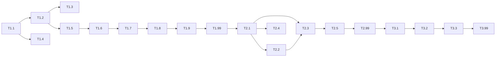

# 実装計画

## 概要

VirtuTuneの実装は、まず仮想ギター機能と進捗管理機能を持つMVP（Minimum Viable Product）を構築し、その後リマインダー機能などの追加機能を実装します。Djangoプロジェクトを機能単位のアプリに分割し、段階的に開発を進めます。

## タスクサマリー

| フェーズ | 総タスク数 | 完了 | 進行中 | 未着手 | ブロック中 |
|---------|------------|------|--------|---------|------------|
| フェーズ1 | 9 | 0 | 0 | 9 | 0 |
| フェーズ2 | 5 | 0 | 0 | 5 | 0 |
| フェーズ3 | 3 | 0 | 0 | 3 | 0 |

---

## フェーズ1: MVP（Minimum Viable Product）

### 🔴 タスク 1.1: Djangoプロジェクトセットアップ

**工数:** 2時間
**依存関係:** なし

- [ ] プロジェクトリポジトリを初期化
  - Djangoプロジェクトを作成: `django-admin startproject config`
  - アプリディレクトリ構造を作成
    - `apps/core`
    - `apps/guitar`
    - `apps/progress`
    - `apps/users`
  - .gitignore と README.md をセットアップ
- [ ] 開発環境をセットアップ
  - requirements.txt を作成
    - Django 5.0+
    - django-ratelimit（レート制限用）
  - 仮想環境の設定手順をドキュメント化
  - 環境変数ファイル（.env.example）を作成
    - SECRET_KEY（必須）
    - DB_PASSWORD（必須、本番）
- [ ] コーディング規約を設定
  - Black（フォーマッター）設定
  - flake8（リンター）設定
  - .flake8, pyproject.toml を作成
- [ ] セキュリティ設定を追加
  - セッションタイムアウト: `SESSION_EXPIRE_AT_BROWSER_CLOSE = True`
  - パスワードリセット有効期限: `PASSWORD_RESET_TIMEOUT = 3600`
  - 環境変数バリデーション関数を実装

**要件:** 開発者要件（保守性要件）、セキュリティ要件

---

### 🔴 タスク 1.2: データベースモデル実装

**工数:** 3時間
**依存関係:** タスク 1.1

- [ ] ユーザーモデルを実装
  ```python
  # apps/users/models.py
  from django.contrib.auth.models import AbstractUser

  class User(AbstractUser):
      daily_goal_minutes = models.IntegerField(default=5)
      reminder_enabled = models.BooleanField(default=False)
      reminder_time = models.TimeField(null=True, blank=True)
      streak_days = models.IntegerField(default=0)
      total_practice_minutes = models.IntegerField(default=0)
  ```
- [ ] 練習セッションモデルを実装
  ```python
  # apps/progress/models.py
  class PracticeSession(models.Model):
      user = models.ForeignKey(User, on_delete=models.CASCADE)
      started_at = models.DateTimeField()
      ended_at = models.DateTimeField(null=True, blank=True)
      duration_minutes = models.IntegerField(default=0)
      chords_practiced = models.JSONField(default=list)
      created_at = models.DateTimeField(auto_now_add=True)
  ```
- [ ] コードモデルを実装
  ```python
  # apps/guitar/models.py
  class Chord(models.Model):
      name = models.CharField(max_length=10, unique=True)
      finger_positions = models.JSONField()
      difficulty = models.IntegerField(default=1)
      diagram = models.TextField(blank=True)
  ```
- [ ] マイグレーションを作成
- [ ] インデックスを作成（user_id, started_at）

**要件:** 要件2（練習時間記録機能）、要件6（ユーザー認証機能）

---

### 🔴 タスク 1.3: ユーザー認証機能実装

**工数:** 3時間
**依存関係:** タスク 1.2

- [ ] 認証設定を構成
  ```python
  # config/settings.py
  AUTH_USER_MODEL = 'users.User'
  LOGIN_URL = 'login'
  LOGOUT_REDIRECT_URL = 'index'
  ```
- [ ] サインアップビューを実装
  - `SignUpView` クラスベースビュー
  - フォームバリデーション
  - ユーザー作成と自動ログイン
- [ ] ログイン/ログアウトビューを実装
  - Djangoの組み込みビューを使用
  - カスタムテンプレート
- [ ] 認証関連URLを設定
  ```python
  # apps/users/urls.py
  path('signup/', views.SignUpView.as_view(), name='signup'),
  path('login/', auth_views.LoginView.as_view(), name='login'),
  path('logout/', auth_views.LogoutView.as_view(), name='logout'),
  ```
- [ ] ログイン必須デコレーターを適用

**要件:** 要件6（ユーザー認証機能）

---

### 🔴 タスク 1.4: ランディングページ実装

**工数:** 2時間
**依存関係:** タスク 1.1

- [ ] ベーステンプレートを作成
  ```html
  <!-- apps/core/templates/core/base.html -->
  
  <!DOCTYPE html>
  <html lang="ja">
  <head>
      <meta charset="UTF-8">
      <meta name="viewport" content="width=device-width, initial-scale=1.0">
      <title>VirtuTune</title>
      <link rel="stylesheet" href="">
  </head>
  <body>
      
      <script src=""></script>
  </body>
  </html>
  ```
- [ ] ランディングページテンプレートを作成
  - サービス概要セクション
  - 新規登録ボタン
  - ログインボタン
  - 特徴説明セクション
- [ ] IndexViewを実装
- [ ] URL設定

**要件:** 要件8（ランディングページ）

---

### 🔴 タスク 1.5: 仮想ギター基本画面実装

**工数:** 4時間
**依存関係:** タスク 1.2, タスク 1.3

- [ ] ギターページテンプレートを作成
  ```html
  <!-- apps/guitar/templates/guitar/guitar.html -->
  <div class="guitar-container">
      <div class="guitar-neck">
          <!-- 6本弦を描画 -->
          <div class="string" data-string="1"></div>
          <div class="string" data-string="2"></div>
          ...
      </div>
      <div class="chord-selector">
          <!-- コード選択ボタン -->
      </div>
      <div class="practice-controls">
          <button id="start-practice">練習開始</button>
          <button id="stop-practice">練習終了</button>
          <div class="timer">00:00</div>
      </div>
  </div>
  ```
- [ ] GuitarViewを実装
  ```python
  class GuitarView(LoginRequiredMixin, TemplateView):
      template_name = 'guitar/guitar.html'

      def get_context_data(self, **kwargs):
          context = super().get_context_data(**kwargs)
          context['chords'] = Chord.objects.all()
          return context
  ```
- [ ] コードデータをシード
  - 基本コード8種類（C, G, Am, F, D, E, Em, A）
  - finger_positions JSONデータ
- [ ] URL設定

**要件:** 要件1（仮想ギター演奏機能）

---

### 🔴 タスク 1.6: 仮想ギターJavaScript実装

**工数:** 4時間
**依存関係:** タスク 1.5

- [ ] 弦のクリックイベントを実装
  ```javascript
  // static/js/guitar.js
  document.querySelectorAll('.string').forEach(string => {
      string.addEventListener('click', (e) => {
          const stringNumber = e.target.dataset.string;
          playString(stringNumber);
          animateString(e.target);
      });
  });
  ```
- [ ] 音声再生を実装
  ```javascript
  function playString(stringNumber, chord) {
      const audio = new Audio(`/static/sounds/strings/string_${stringNumber}.mp3`);
      audio.play();
  }
  ```
- [ ] 弦振動アニメーションを実装
  ```css
  /* static/css/styles.css */
  @keyframes vibrate {
      0%, 100% { transform: translateY(0); }
      25% { transform: translateY(-2px); }
      75% { transform: translateY(2px); }
  }
  .string.vibrating {
      animation: vibrate 0.1s linear 3;
  }
  ```
- [ ] コード切り替え機能を実装
  ```javascript
  function changeChord(chordName) {
      const chord = chords.find(c => c.name === chordName);
      updateFingerPositions(chord.finger_positions);
  }
  ```

**要件:** 要件1（仮想ギター演奏機能）

---

### 🔴 タスク 1.7: 練習時間記録機能実装

**工数:** 3時間
**依存関係:** タスク 1.5, タスク 1.6

- [ ] 練習開始APIを実装
  ```python
  # apps/guitar/views.py
  @require_POST
  def start_practice(request):
      session = PracticeSession.objects.create(
          user=request.user,
          started_at=timezone.now()
      )
      return JsonResponse({'session_id': session.id})
  ```
- [ ] 練習終了APIを実装
  ```python
  @require_POST
  def end_practice(request):
      data = json.loads(request.body)
      session = PracticeSession.objects.get(id=data['session_id'], user=request.user)
      session.ended_at = timezone.now()
      session.duration_minutes = calculate_duration(session.started_at, session.ended_at)
      session.chords_practiced = data.get('chords', [])
      session.save()
      update_user_stats(request.user, session.duration_minutes)
      return JsonResponse({'success': True})
  ```
- [ ] タイマー機能を実装
  ```javascript
  let practiceStartTime = null;
  let timerInterval = null;

  function startTimer() {
      practiceStartTime = new Date();
      timerInterval = setInterval(updateTimer, 1000);
  }

  function updateTimer() {
      const elapsed = Math.floor((new Date() - practiceStartTime) / 1000);
      const minutes = String(Math.floor(elapsed / 60)).padStart(2, '0');
      const seconds = String(elapsed % 60).padStart(2, '0');
      document.querySelector('.timer').textContent = `${minutes}:${seconds}`;
  }
  ```
- [ ] 使用コードの記録を実装
  ```javascript
  let practicedChords = new Set();

  function recordChord(chordName) {
      practicedChords.add(chordName);
  }
  ```

**要件:** 要件2（練習時間記録機能）

---

### 🔴 タスク 1.8: 進捗表示機能実装

**工数:** 4時間
**依存関係:** タスク 1.7

- [ ] ProgressServiceを実装
  ```python
  # apps/progress/services.py
  class ProgressService:
      @staticmethod
      def get_daily_stats(user, days=7):
          """過去N日間の練習時間を取得"""
          pass

      @staticmethod
      def get_total_stats(user):
          """総練習時間、ストリーク等の統計を取得"""
          pass

      @staticmethod
      def calculate_streak(user):
          """連続練習日数を計算"""
          pass
  ```
- [ ] ProgressViewを実装
  ```python
  class ProgressView(LoginRequiredMixin, TemplateView):
      template_name = 'progress/progress.html'

      def get_context_data(self, **kwargs):
          context = super().get_context_data(**kwargs)
          context['daily_stats'] = ProgressService.get_daily_stats(self.request.user, 7)
          context['total_stats'] = ProgressService.get_total_stats(self.request.user)
          return context
  ```
- [ ] 進捗ページテンプレートを作成
  ```html
  <div class="stats-summary">
      <div class="stat-card">
          <span class="stat-label">今日の練習</span>
          <span class="stat-value">{{ today_minutes }}分</span>
      </div>
      <div class="stat-card">
          <span class="stat-label">連続日数</span>
          <span class="stat-value">{{ streak_days }}日</span>
      </div>
  </div>
  <canvas id="progress-chart"></canvas>
  ```
- [ ] Chart.jsでグラフ描画を実装

**要件:** 要件3（進捗表示機能）

---

### 🔴 タスク 1.9: 目標設定機能実装

**工数:** 2時間
**依存関係:** タスク 1.8

- [ ] 目標達成チェックを実装
  ```python
  def check_goal_achievement(user):
      today_minutes = PracticeSession.objects.filter(
          user=user,
          started_at__date=timezone.now().date()
      ).aggregate(total=models.Sum('duration_minutes'))['total'] or 0

      return {
          'achieved': today_minutes >= user.daily_goal_minutes,
          'today_minutes': today_minutes,
          'goal_minutes': user.daily_goal_minutes
      }
  ```
- [ ] 進捗ページに目標状況を表示
- [ ] 目標達成時の視覚的フィードバックを実装
  ```css
  .goal-achieved {
      background: linear-gradient(135deg, #667eea 0%, #764ba2 100%);
      animation: celebrate 0.5s ease;
  }
  ```
- [ ] 目標未達成時の励ましメッセージを表示

**要件:** 要件4（目標設定機能）

---

### 🔴 タスク 1.99: フェーズ1 リファクタリングとコード品質レビュー

**工数:** 4-8時間
**依存関係:** すべてのフェーズ1タスクの完了
**タイプ:** リファクタリング

- [ ] コード品質分析
  - flake8を実行し警告を修正
  - Blackでフォーマット統一
  - 未使用importを削除
- [ ] コンポーネント間レビュー
  - 共通ユーティリティを抽出
  - 重複コードを排除
  - 一貫した命名規則を適用
- [ ] パフォーマンス最適化
  - N+1クエリを解消
  - インデックスが正しく使われているか確認
- [ ] テスト追加
  - ユニットテストを追加しカバレッジ80%を目指す
  - 統合テストを追加
- [ ] ドキュメント更新
  - README.mdにセットアップ手順を記載
  - APIエンドポイントをドキュメント化
- [ ] 技術的負債の評価
  - 懸念事項をリスト化
  - フェーズ2での改善計画を作成

**要件:** 開発者要件（テスト要件、保守性要件）

---

## フェーズ2: 機能拡張

### 🔴 タスク 2.1: プロフィール管理機能実装

**工数:** 3時間
**依存関係:** フェーズ1の完了

- [ ] ProfileViewを実装
  ```python
  class ProfileView(LoginRequiredMixin, TemplateView):
      template_name = 'users/profile.html'

      def get_context_data(self, **kwargs):
          return {'user': self.request.user}
  ```
- [ ] プロフィール更新フォームを実装
  ```python
  class ProfileUpdateForm(forms.ModelForm):
      class Meta:
          model = User
          fields = ['username', 'daily_goal_minutes', 'reminder_enabled', 'reminder_time']
  ```
- [ ] プロフィール更新ビューを実装
- [ ] アカウント削除機能を実装
- [ ] プロフィールテンプレートを作成

**要件:** 要件7（プロフィール管理機能）

---

### 🔴 タスク 2.2: Celeryセットアップとリマインダー実装

**工数:** 4時間
**依存関係:** タスク 2.1

- [ ] Celeryをセットアップ
  ```python
  # config/celery.py
  from celery import Celery

  app = Celery('virtutune')
  app.config_from_object('django.conf:settings', namespace='CELERY')
  app.autodiscover_tasks()
  ```
- [ ] Celery Beat設定
- [ ] ReminderServiceを実装
  ```python
  # apps/reminders/services.py
  @app.task
  def send_daily_reminders():
      users = User.objects.filter(reminder_enabled=True)
      for user in users:
          # リマインダー時刻チェックと送信
          pass
  ```
- [ ] ストリーク警告タスクを実装
  ```python
  @app.task
  def check_missed_practices():
      # 前日練習していないユーザーを検出
      pass
  ```
- [ ] メールテンプレートを作成

**要件:** 要件5（練習リマインダー機能）

---

### 🔴 タスク 2.3: 進捗グラフ強化

**工数:** 3時間
**依存関係:** タスク 2.1

- [ ] 30日間グラフを実装
- [ ] グラフ切替機能（7日/30日）を実装
- [ ] レスポンシブデザイン対応
- [ ] カラーテーマを最適化

**要件:** 要件3（進捗表示機能）

---

### 🔴 タスク 2.4: パスワードリセット機能実装

**工数:** 2時間
**依存関係:** タスク 2.1

- [ ] パスワードリセットビューを実装
  - Djangoの組み込みビュー（PasswordResetView, PasswordResetConfirmView）を使用
- [ ] メール送信設定
  - パスワードリセット用メールテンプレート
- [ ] リセットフォームを実装
- [ ] URL設定
- [ ] **セキュリティ設定**: トークン有効期限を1時間に設定
  ```python
  # config/settings.py
  PASSWORD_RESET_TIMEOUT = 3600  # 1時間
  ```

**要件:** 要件6（ユーザー認証機能）、セキュリティ要件

---

### 🔴 タスク 2.5: モバイル対応とUI改善

**工数:** 4時間
**依存関係:** フェーズ2の完了

- [ ] レスポンシブCSSを改善
  - メディアクエリの追加
  - タッチ操作の最適化
- [ ] ギター画面のモバイルレイアウト調整
- [ ] 進捗画面のモバイルレイアウト調整
- [ ] ナビゲーションメニューの実装（ハンバーガーメニュー）

**要件:** ユーザビリティ要件

---

### 🔴 タスク 2.99: フェーズ2 リファクタリング

**工数:** 4時間
**依存関係:** すべてのフェーズ2タスクの完了

- [ ] コードレビュー
- [ ] テストカバレッジ確認
- [ ] パフォーマンスチェック
- [ ] ドキュメント更新

**要件:** 開発者要件

---

## フェーズ3: 本番化対応

### 🔴 タスク 3.1: PostgreSQL移行

**工数:** 3時間
**依存関係:** フェーズ2の完了

- [ ] PostgreSQLデータベースを作成
- [ ] settings.pyで本番DB設定
- [ ] マイグレーション実行
- [ ] データ移行スクリプト作成

**要件:** スケーラビリティ要件

---

### 🔴 タスク 3.2: 本番デプロイ設定

**工数:** 4時間
**依存関係:** タスク 3.1

- [ ] Gunicorn設定
- [ ] Nginx設定
- [ ] 静的ファイル配信設定
- [ ] SSL証明書設定（Let's Encrypt）
- [ ] 環境変数管理

**要件:** セキュリティ要件、可用性要件

---

### 🔴 タスク 3.3: 本番デプロイとテスト

**工数:** 2時間
**依存関係:** タスク 3.2

- [ ] デプロイスクリプト作成
- [ ] 本番環境デプロイ
- [ ] 本番環境テスト
- [ ] エラー監視設定

**要件:** 可用性要件

---

### 🔴 タスク 3.99: フェーズ3 リファクタリング

**工数:** 2時間
**依存関係:** すべてのフェーズ3タスクの完了

- [ ] 本番環境でのパフォーマンス確認
- [ ] ログ出力の最適化
- [ ] バックアップ戦略の実装
- [ ] 最終ドキュメント更新

**要件:** 開発者要件

---

## タスク依存関係の視覚化



---

## 実装チームへの注意事項

- **TDDアプローチ**: テストを先に書き、その後実装する
- **小さなコミット**: タスク単位で小さくコミットする
- **コードレビュー**: すべての変更をレビューする
- **ドキュメント**: コメントは日本語で記述する
- **タスク更新**: 作業進行に応じてこのドキュメントのステータスを更新する

---

## 変更ログ

| 日付 | タスク | 変更 | 理由 |
|------|--------|------|------|
| 2026-01-27 | - | 初期作成 | VirtuTuneプロジェクトの実装計画 |
| 2026-01-27 | セキュリティレビュー | レート制限要件を追加 | ブルートフォース攻撃対策 |
| 2026-01-27 | セキュリティレビュー | セッションタイムアウト設定を追加 | セッションハイジャック対策 |
| 2026-01-27 | セキュリティレビュー | パスワードリセットトークン有効期限を明記 | トークン盗難リスク低減 |
| 2026-01-27 | セキュリティレビュー | セキュリティヘッダー設定を追加 | HTTPS強化、クリックジャッキング対策 |

---

## 備考

- 各タスクの完了条件: 実装完了、テスト合格、コードレビュー済み
- ステータス更新: 🔴 → 🟡 → 🟢 の順で更新
- ブロックが発生した場合は ⚠️ に変更し、ブロッカーを記載
